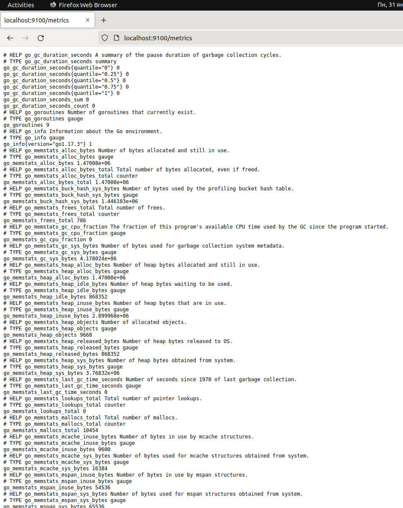
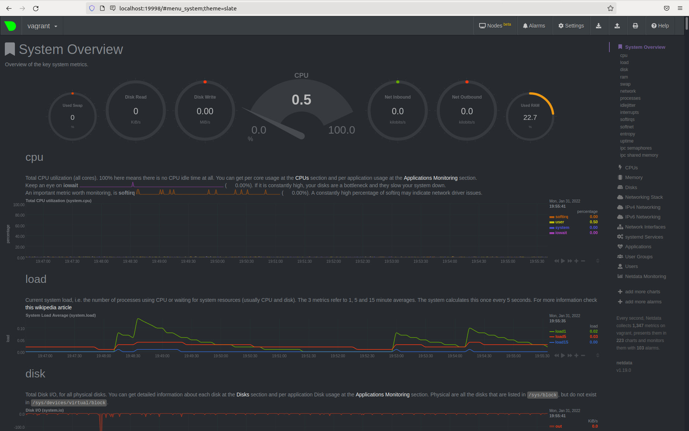

1. После скачивания и распаковки переместил node_exporter в /usr/local/bin.
создал пользователя sudo useradd -rs /bin/false node_exporter  
в файле node_exporter.service: 
sudo nano /etc/systemd/system/node_exporter.service  
прописал: 
[Unit]  
Description=Node Exporter 
EnvironmentFile=/etc/default/node_exporter 
After=network.target 
 
[Service] 
User=node_exporter 
Group=node_exporter 
Type=simple 
ExecStart=/usr/local/bin/node_exporter 
 
[Install] 
WantedBy=multi-user.target 
проверил работу:  
sudo systemctl daemon-reload 
sudo systemctl start node_exporter 
sudo systemctl enable node_exporter 
sudo systemctl status node_exporter 
 
● node_exporter.service - Node Exporter 
     Loaded: loaded (/etc/systemd/system/node_exporter.service; enabled; vendor preset: enabled) 
     Active: active (running) since Mon 2022-01-31 22:43:44 +05; 2h 51min left 
   Main PID: 1426 (node_exporter) 
      Tasks: 11 (limit: 38389) 
     Memory: 17.5M 
        CPU: 377ms 

2. 

Для мониторинга памяти: 
node_memory_MemAvailable_bytes Memory information field MemAvailable_bytes. 
node_memory_MemFree_bytes Memory information field MemFree_bytes. 
node_memory_MemTotal_bytes Memory information field MemTotal_bytes. 
Для мониторинга диска: 
node_disk_read_time_seconds_total The total number of seconds spent by all reads. 
node_disk_write_time_seconds_total This is the total number of seconds spent by all writes. 
Для мониторинга сети: 
node_network_receive_packets_total Network device statistic receive_packets. 
node_network_transmit_packets_total Network device statistic transmit_packets. 
Для мониторинга процессора: 
process_cpu_seconds_total Total user and system CPU time spent in seconds. 

3. 
метрики: 
cpu: 
Total CPU utilization (all cores). 100% here means there is no CPU idle time at all. 
load: 
Current system load, i.e. the number of processes using CPU or waiting for system resources (usually CPU and disk) 
disk: 
Total Disk I/O, for all physical disks 

4. По выводу dmsg можно понять, что ОС, что загружена не на настоящем оборудовании  
vagrant@vagrant:~$ sudo dmesg | grep "Hypervisor detected" 
[    0.000000] Hypervisor detected: KVM

5. vagrant@vagrant:~$ sysctl -n fs.nr_open  
1048576 
This denotes the maximum number of file-handles a process can
allocate. Default value is 1024*1024 (1048576)  

vagrant@vagrant:~$ ulimit -a 
open files         (-n) 1024 
другой существующий лимит не позволит достичь такого числа:  
-n	the maximum number of open file descriptors

6. root@Computer:~# unshare -f -p --mount-proc /bin/bash 

root@Computer:~# sleep 1h 
^Z 
[1]+  Stopped                 sleep 1h 
root@Computer:~# ps 
    PID TTY          TIME CMD 
      1 pts/1    00:00:00 bash 
      9 pts/1    00:00:00 sleep 
     10 pts/1    00:00:00 ps 

но когда подключаюсь из хостового неймспейса PID-ы родителя: 
root@Computer:~# ps aux 
root        6369  0.0  0.0  16988   940 pts/1    S    19:22   0:00 unshare -f -p --mount-proc /bin/bash 
root        6822  0.0  0.0  19872  5496 pts/0    S    19:27   0:00 -bash 

root@Computer:~# nsenter --target 6369 --pid --mount 
root@Computer:/# ps 
Error, do this: mount -t proc proc /proc 
root@Computer:/# mount -t proc proc /proc 
root@Computer:/#  
root@Computer:/# ps 
    PID TTY          TIME CMD 
   6816 pts/0    00:00:00 sudo 
   6822 pts/0    00:00:00 bash 
   6998 pts/0    00:00:00 nsenter 
   6999 pts/0    00:00:00 bash 
   7031 pts/0    00:00:00 ps 

7. :(){ :|:& };: - это форк-бомба, когда создается процесс, который порождает новый процесс и т.д., пока не будут использованы все ресурсы. 
[  963.683784] cgroup: fork rejected by pids controller in /user.slice/user-1000.slice/session-5.scope 
автоматической стабилизации помог механизм Linux Control Cgroups, обеспечивающий изоляцию процессов в плане потребления ресурсов. 
по умолчанию: 
vagrant@vagrant:~$ ulimit -a 
max user processes              (-u) 3571 
Если установить ulimit -u 50 - число процессов будет ограничено 50 для пользователя.  

