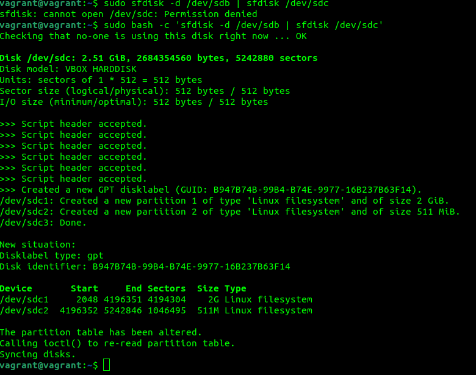
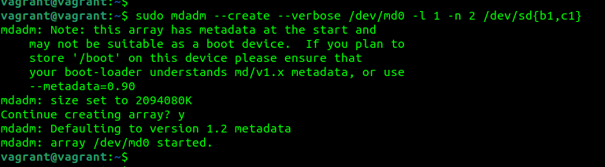
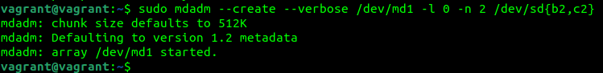
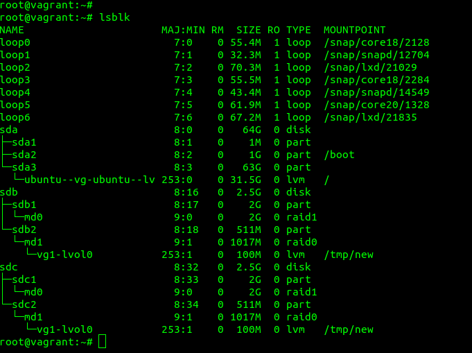

1. Разрежённый файл — файл, в котором последовательности нулевых байтов заменены на информацию об этих последовательностях (список дыр).
2. Жесткая ссылка и файл, для которой она создавалась имеют одинаковые inode. Поэтому жесткая ссылка имеет те же права доступа, владельца и время последней модификации, что и целевой файл. Различаются только имена файлов. Фактически жесткая ссылка это еще одно имя для файла.
3. andy@Computer:~/Desktop/Vagrant$ vagrant destroy  
    default: Are you sure you want to destroy the 'default' VM? [y/N] y 
==> default: Destroying VM and associated drives... 

4. Device       Start     End Sectors  Size Type 
/dev/sdb1     2048 4196351 4194304    2G Linux filesystem 
/dev/sdb2  4196352 5242846 1046495  511M Linux filesystem 
5.  
6.  

7.  
8. vagrant@vagrant:~$ sudo pvcreate /dev/md1 /dev/md0 
  Physical volume "/dev/md1" successfully created. 
  Physical volume "/dev/md0" successfully created. 

9. vagrant@vagrant:~$ sudo vgcreate vg1 /dev/md1 /dev/md0 
  Volume group "vg1" successfully created 
10. vagrant@vagrant:~$ sudo lvcreate -L 100M vg1 /dev/md1 
  Logical volume "lvol0" created. 
11. vagrant@vagrant:~$ sudo mkfs.ext4 /dev/vg1/lvol0 
mke2fs 1.45.5 (07-Jan-2020) 
Creating filesystem with 25600 4k blocks and 25600 inodes 
Allocating group tables: done                             
Writing inode tables: done                             
Creating journal (1024 blocks): done 
Writing superblocks and filesystem accounting information: done 
12. vagrant@vagrant:~$ mkdir /tmp/new 
vagrant@vagrant:~$ sudo mount /dev/vg1/lvol0 /tmp/new 
13. root@vagrant:~# wget https://mirror.yandex.ru/ubuntu/ls-lR.gz -O /tmp/new/test.gz 
--2022-02-06 11:46:55--  https://mirror.yandex.ru/ubuntu/ls-lR.gz 
Resolving mirror.yandex.ru (mirror.yandex.ru)... 213.180.204.183, 2a02:6b8::183 
Connecting to mirror.yandex.ru (mirror.yandex.ru)|213.180.204.183|:443... connected. 
HTTP request sent, awaiting response... 200 OK 
Length: 22107112 (21M) [application/octet-stream] 
Saving to: ‘/tmp/new/test.gz’ 
 
/tmp/new/test.gz                                     100%[=====================================================================================================================>]  21.08M  10.2MB/s    in 2.1s     
 
2022-02-06 11:46:57 (10.2 MB/s) - ‘/tmp/new/test.gz’ saved [22107112/22107112] 
root@vagrant:~# 

14.  
15. root@vagrant:~# gzip -t /tmp/new/test.gz  
root@vagrant:~# echo $?  
0  
16. root@vagrant:~# pvmove /dev/md1 /dev/md0  
  /dev/md1: Moved: 12.00%  
  /dev/md1: Moved: 100.00%  
17. root@vagrant:~# mdadm /dev/md0 --fail /dev/sdb1  
mdadm: set /dev/sdb1 faulty in /dev/md0  
18. [ 5183.011599] md/raid1:md0: Disk failure on sdb1, disabling device.  
               md/raid1:md0: Operation continuing on 1 devices.  
19. root@vagrant:~# gzip -t /tmp/new/test.gz  
root@vagrant:~# echo $?  
0  
20. andy@Computer:~/Desktop/Vagrant$ vagrant destroy  
    default: Are you sure you want to destroy the 'default' VM? [y/N] y  
==> default: Forcing shutdown of VM...  
==> default: Destroying VM and associated drives...  

