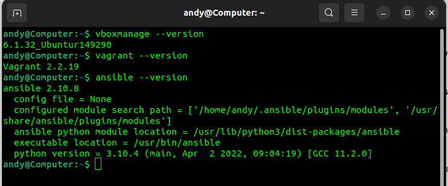
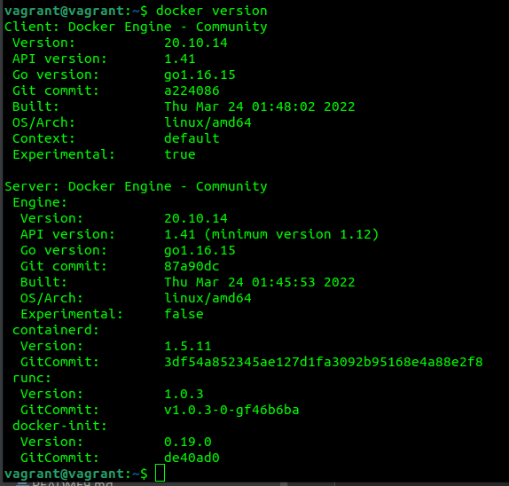

1. * Основным преимуществом применения на практике IaaC паттернов является возможность представления физического оборудования в виде программного кода, т.е. возможность создания виртуальных серверов с заданными параметрами при помощи конфигурационных файлов. Это позволяет ускорить процесс предоставления инфраструктуры по мере необходимости, устранить несовпадения сред разработки и развертывания, что ускоряет процесс доставки ПО.  
   * Основным принципом IaaC является идемпотентность - это свойство операции, при повторном выполнении которой получается результат, идентичный предыдущему, независимо от количества повторений. 
2. * Ansible отличается от других систем управления конфигурациями тем, что использует существующую инфраструктуру SSH и не требует настройки PKI-окружения, в отличие от других инструментов управления конфигурациями. 
   * Оба метода метода push и pull являются надёжными, однако при большом количестве серверов метод push может использовать чрезмерное количество вычислительных ресурсов для передачи конфигураций. Метод pull этого недостатка лишён, однако он более сложен для конфигурирования. 
3.   

4.   