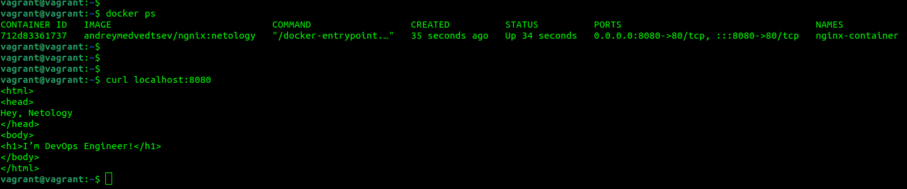
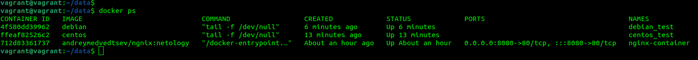
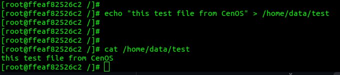
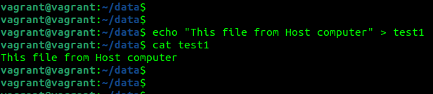
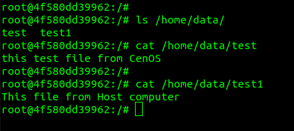

1. https://hub.docker.com/repository/docker/andreymedvedtsev/ngnix 

2. 
* Высоконагруженное монолитное java веб-приложение; 
контейнеры Docker используются в основном в микросервисной архитектуре приложений, поэтому для монолитного приложения лучше использовать виртуальную или физическую машину. 
* Nodejs веб-приложение; 
Использование Docker позволит оптимизировать процесс разработки и вывода в продакшн Node.js приложения поскольку есть возможность упаковать все зависимости и настройки в единый образ 
* Мобильное приложение c версиями для Android и iOS; 
Для разработки мобильного приложения предпочтительно использование отдельных контейнеров для разных ОС, в которых зависимости и настройки находятся в едином образе 
* Шина данных на базе Apache Kafka; 
Шина данных может использоваться для связи микросервисов, поэтому использование Docker контейнеров в данном случае подходит 
* Elasticsearch кластер для реализации логирования продуктивного веб-приложения - три ноды elasticsearch, два logstash и две ноды kibana; 
Logstash отвечает за логирование и поставляет входящий поток данных в Elasticsearch для хранения, классификации и поиска. Kibana, в свою очередь, получает доступ к данным Elasticsearch для их визуализации. Всё это можно реализовать в контейнерах Docker 
* Мониторинг-стек на базе Prometheus и Grafana; 
Поскольку Prometheus получает метрики из разных сервисов и собирает их в одном месте, а Grafana получает данные из Prometheus посредством http запросов, указанный мониторинг-стек может быть реализован как на виртуальная или физической машине, так и в контейнере Docker  
* MongoDB, как основное хранилище данных для java-приложения; 
Java-приложение подключается к БД используя сетевой порт, поэтому возможно использование как виртуальной или физической машины, так и контейнера Docker 
* Gitlab сервер для реализации CI/CD процессов и приватный (закрытый) Docker Registry. 
Создание приватного Docker Registry выполняется посредством установки и соответствующей настройки контейнера Docker. Установка Gitlab CI/CD также возможна из контейнера Docker          
3.
* Запустите первый контейнер из образа centos c любым тэгом в фоновом режиме, подключив папку /data из текущей рабочей директории на хостовой машине в /data контейнера 
docker run -d -v /home/vagrant/data:/home/data --name centos_test centos tail -f /dev/null 
* Запустите второй контейнер из образа debian в фоновом режиме, подключив папку /data из текущей рабочей директории на хостовой машине в /data контейнера 
docker run -d -v /home/vagrant/data:/home/data --name debian_test debian tail -f /dev/null 
 
* Подключитесь к первому контейнеру с помощью docker exec и создайте текстовый файл любого содержания в /data; 
docker exec -it centos_test bash 
echo "this test file from CenOS" > /home/data/test 
 
* Добавьте еще один файл в папку /data на хостовой машине; 
echo "This file from Host computer" > test1 
 
* Подключитесь во второй контейнер и отобразите листинг и содержание файлов в /data контейнера. 
docker exec -it debian_test bash 
 

4. https://hub.docker.com/repository/docker/andreymedvedtsev/ansible 