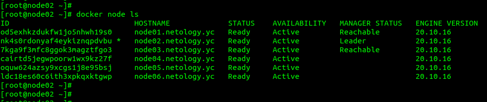
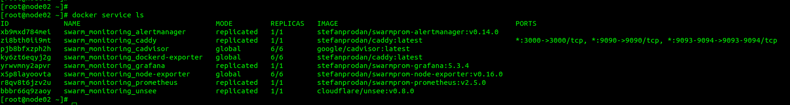
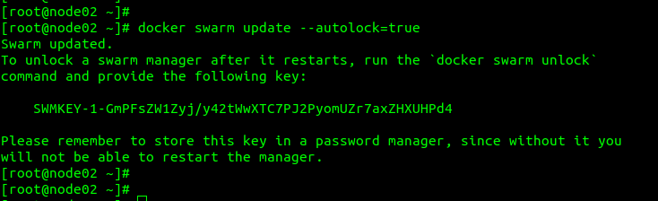

1. * Отличие режимов работы сервисов в Docker Swarm кластере в том, что в режиме global экземпляр микросервиса работает на всех нодах кластера, в режиме replication количество экземпляров микросервисов выполняемых в кластере задаётся. 
   * в Docker Swarm кластере для выбора лидера используется алгоритм поддержания распределенного консенсуса — Raft 
   * Overlay Network — общий случай логической сети, создаваемой поверх другой сети. Узлы оверлейной сети могут быть связаны либо физическим соединением, либо логическим, для которого в основной сети существуют один или несколько соответствующих маршрутов из физических соединений. 
     Overlay-сети используются в контексте кластеров (Docker Swarm), где виртуальная сеть, которую используют контейнеры, связывает несколько физических хостов, на которых запущен Docker.  
2.   

3.   

4. команда docker swarm update --autolock=true включает автоблокировку менеджера при перезагрузке Docker. Это позволяет защитить Docker swarm при помощи ключа шифрования, который необходимо ввести после рестарта Docker на менеджере, когда swarm становится закрытым. 
 