1.  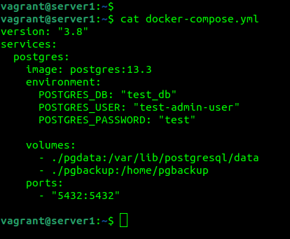 
2.  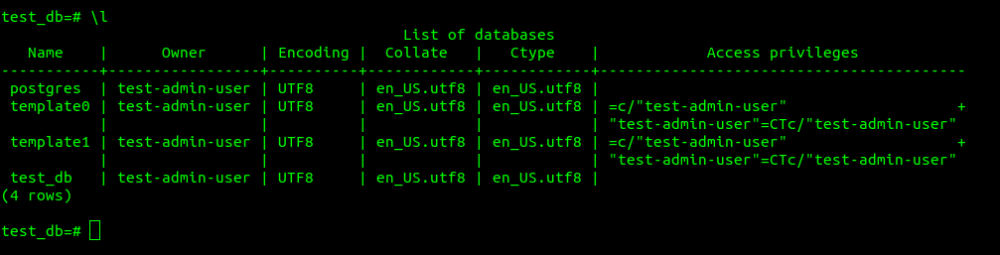 

SELECT * FROM information_schema.table_privileges; 
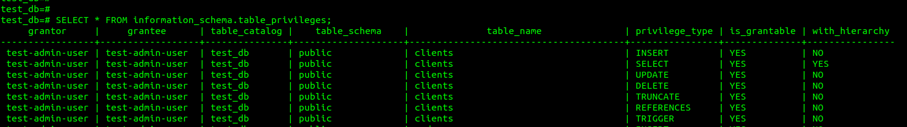
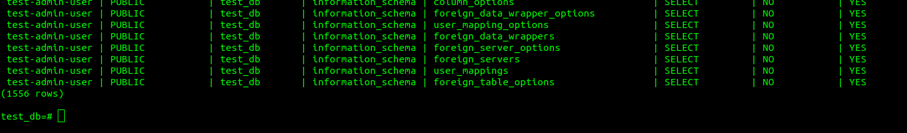
SELECT * FROM information_schema.table_privileges where grantee = 'test-simple-user'; 
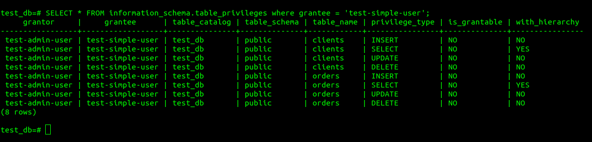
3. insert into orders VALUES (1, 'Шоколад', 10), (2, 'Принтер', 3000), (3, 'Книга', 500), (4, 'Монитор', 7000), (5, 'Гитара', 4000); 
insert into clients VALUES (1, 'Иванов Иван Иванович', 'USA'), (2, 'Петров Петр Петрович', 'Canada'), (3, 'Иоганн Себастьян Бах', 'Japan'), (4, 'Ронни Джеймс Дио', 'Russia'), (5, 'Ritchie Blackmore', 'Russia'); 
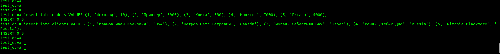 
 
4. update clients set заказ = 3 where id = 1; 
update clients set заказ = 4 where id = 2; 
update clients set заказ = 5 where id = 3; 
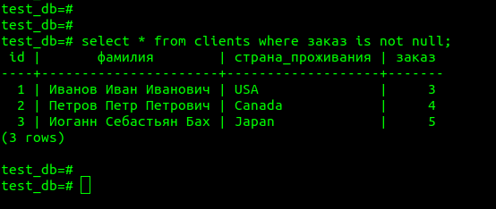 
5.  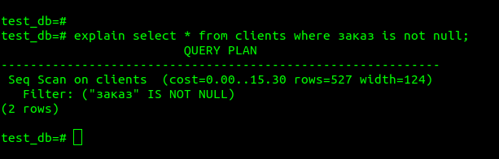 
команда explain select * from clients where заказ is not null; показывает подробный план запроса - последовательное сканирование в таблице clients, с фильтром - "заказ" IS NOT NULL, показывает стоимость запроса (нагрузку на исполнение) 
6. root@da14e70516fa:/# pg_dump -U test-admin-user -d test_db > /home/pgbackup/test_db_dump.sql 
docker-compose down 
создал новый docker-compose1.yml: 
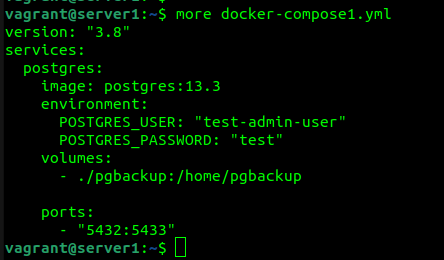 
docker-compose -f docker-compose1.yml up -d 
docker exec -it d1d03e8ce38b bash 
root@d1d03e8ce38b:/# psql -U test-admin-user 
test-admin-user=# CREATE DATABASE test_db; 
root@d1d03e8ce38b:/# psql -U test-admin-user -d test_db < /home/pgbackup/test_db_dump.sql 
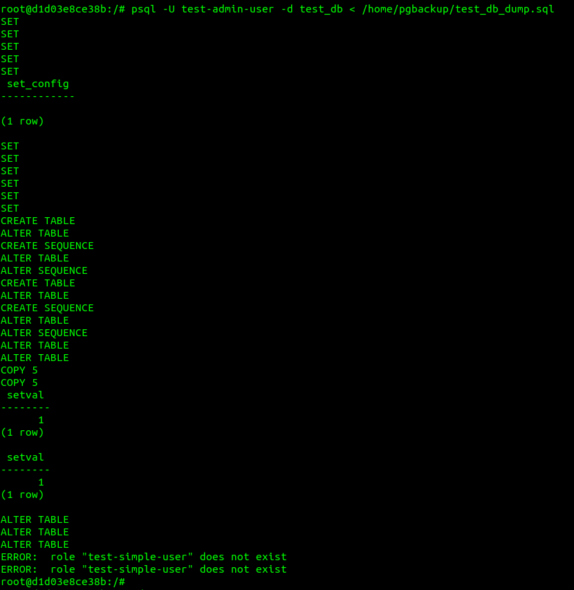 
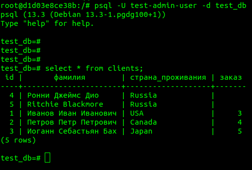 