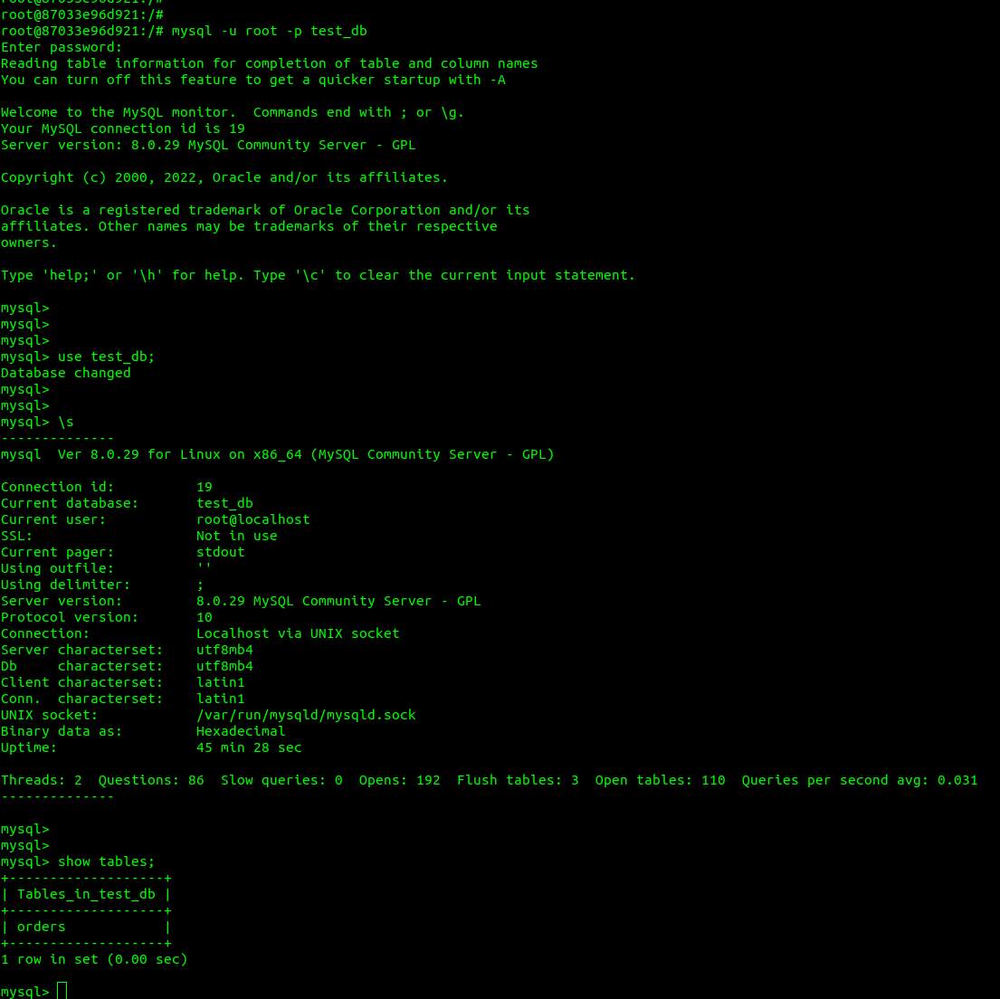
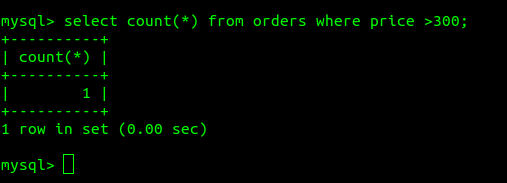
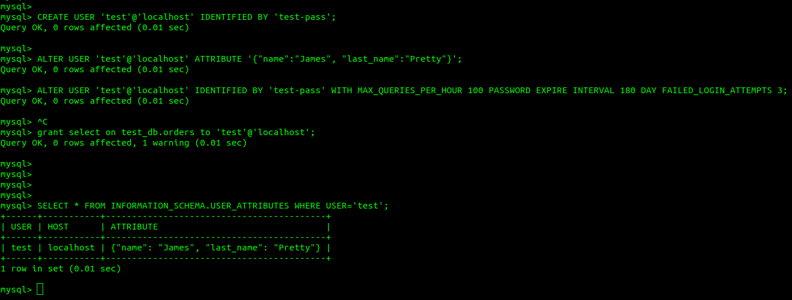
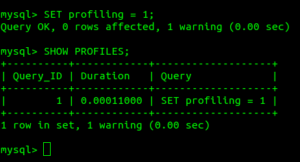
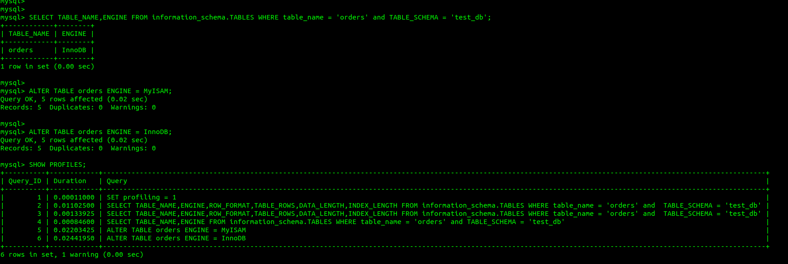
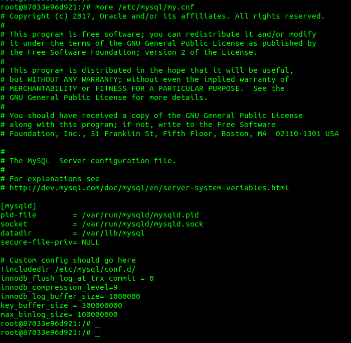

1.   
 
2.   
3.   
 
используется engine InnoDB 
время переключения на MyISAM =  0.02203425 
время переключения на InnoDB = 0.02441950 
4.   
добавлены строки: 
innodb_flush_log_at_trx_commit = 0 
innodb_compression_level=9 
innodb_log_buffer_size= 1000000 
key_buffer_size = 300000000 
max_binlog_size= 100000000 
