1.  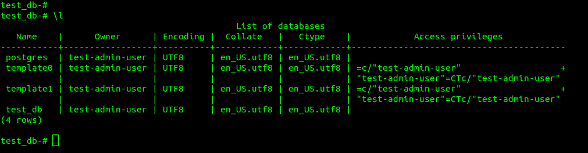 
вывод списка БД - \l 
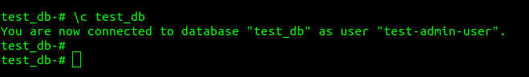 
подключение к БД - \c 
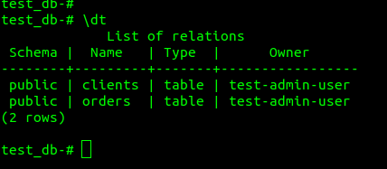 
вывод списка таблиц - \dt 
 
вывод описания содержимого таблиц - \d+ имя_таблицы 
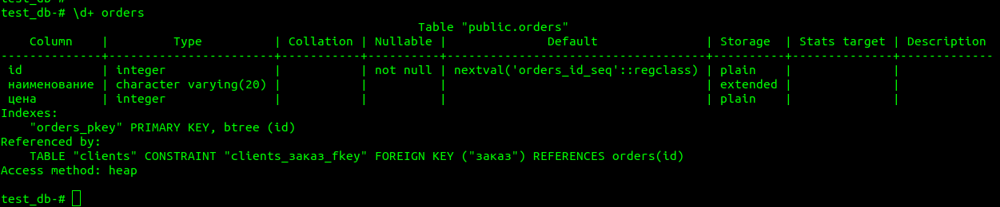 
выход из psql - \q 
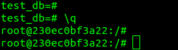 

2.  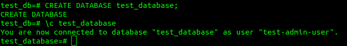 
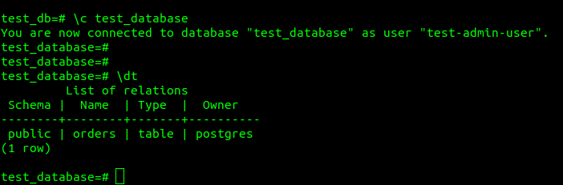 
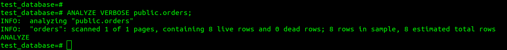 
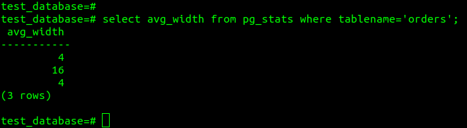 

3. требуется создать партицированную таблицу и скопировать в неё данные из исходной 
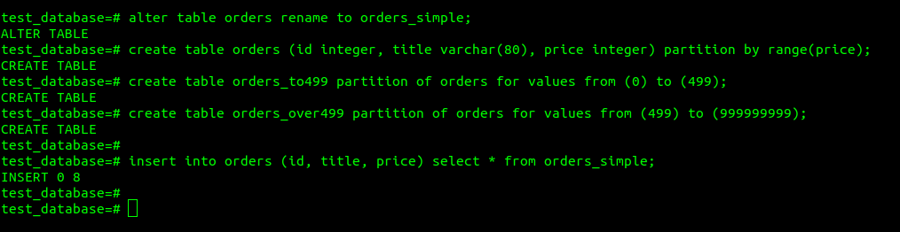 
При проектировании таблиц необходимо было сделать ее партицированной, тогда не пришлось бы переименовывать исходную таблицу и переносить данные в новую.При проектировании таблиц необходимо было сделать ее партицированной, тогда не пришлось бы переименовывать исходную таблицу и переносить данные в новую. 
4. root@230ec0bf3a22:/# pg_dump -U test-admin-user -d test_database > /home/pgbackup/test_database_dump.sql 
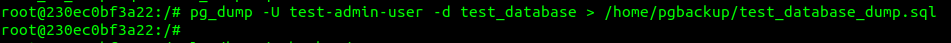
чтобы добавить уникальность значения столбца title для таблиц test_database можно добавить первичный ключ. 