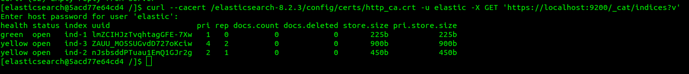

1.   
https://hub.docker.com/repository/docker/andreymedvedtsev/elasticsearch 
 
 
 

2. добавьте в elasticsearch 3 индекса 
 
Получите список индексов и их статусов, используя API 
 
 
Получите состояние кластера elasticsearch, используя API 

индексы в статусе Yellow потому что у них указано число реплик, но репликация не выполняется, поскольку нет других нод. 
Удалите все индексы 
curl --cacert /elasticsearch-8.2.3/config/certs/http_ca.crt -u elastic curl -X DELETE https://localhost:9200/ind-1?pretty  
curl --cacert /elasticsearch-8.2.3/config/certs/http_ca.crt -u elastic curl -X DELETE https://localhost:9200/ind-2?pretty   
curl --cacert /elasticsearch-8.2.3/config/certs/http_ca.crt -u elastic curl -X DELETE https://localhost:9200/ind-3?pretty   
 
3. Используя API зарегистрируйте директорию как snapshot repository c именем netology_backup 
 
Создайте индекс test с 0 реплик и 1 шардом и приведите в ответе список индексов.
 
Создайте snapshot состояния кластера elasticsearch 
 
Приведите в ответе список файлов в директории со snapshotами 
 
Удалите индекс test и создайте индекс test-2. Приведите в ответе список индексов 
 
Восстановите состояние кластера elasticsearch из snapshot, созданного ранее 
Приведите в ответе запрос к API восстановления и итоговый список индексов 
 