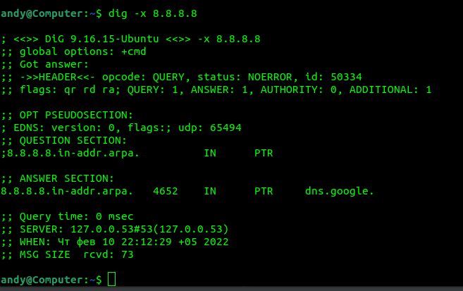

1.  
Код состояния HTTP 301 или Moved Permanently (с англ. — «Перемещено навсегда») — стандартный код ответа HTTP, получаемый в ответ от сервера в ситуации, когда запрошенный ресурс был на постоянной основе перемещён в новое месторасположение, и указывающий на то, что текущие ссылки, использующие данный URL, должны быть обновлены. Адрес нового месторасположения ресурса указывается в поле Location получаемого в ответ заголовка пакета протокола HTTP 
2.   
код ответа 200 - ОК
 
дольше всего обрабатывался запрос GET - 168 ms 
3. мой ip - 46.250.75.132 
 
4.   
Провайдер - Mobile TeleSystems PJSC Ural Branch 
AS - 41822 
5.   
AS8359: 
212.188.55.61  
212.188.2.101  
212.188.29.85  
195.34.50.161  
212.188.29.82  

AS15169: 
108.170.250.66 
108.170.235.204 
6.   
наибольшая задержка происходит на хосте 142.251.49.24 
7.   
за доменное имя dns.google отвечают сервера 8.8.8.8 и 8.8.4.4 
записи типа А: 
dns.google.		655	IN	A	8.8.8.8 
dns.google.		655	IN	A	8.8.4.4 
8.  
к ip 8.8.8.8 привязано имя dns.google
