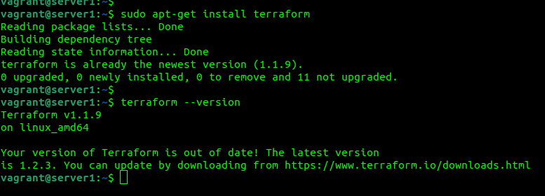
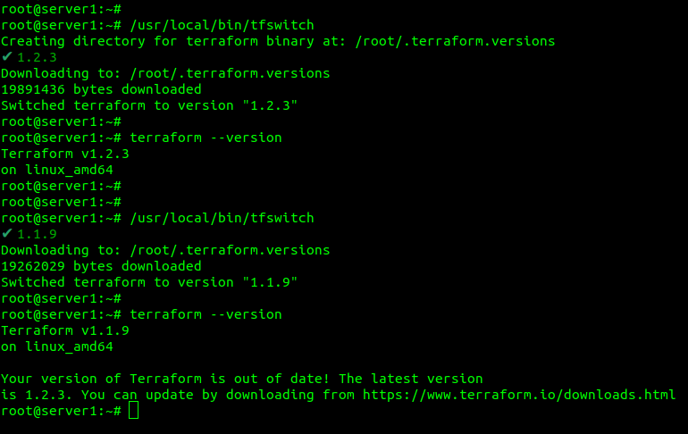

1.
* Какой тип инфраструктуры будем использовать для этого проекта: изменяемый или не изменяемый? 
В связи с планируемым ростом количества продуктивных серверов для поддержания их единой конфигурации лучше использовать неизменяемую архитектуру. Также это необходимо чтобы конфигурация тестовых и продуктивных серверов была идентичной.   
* Будет ли центральный сервер для управления инфраструктурой? 
Поскольку для инициализации ресурсов будет использоваться Terraform, для конфигурации серверов Ansible или будут использованы контейнеры Docker необходимости в центральном сервере для управления конфигурациями нет. 
* Будут ли агенты на серверах? 
Terraform, Ansible, Docker не требуют установки агентов на серверы. 
* Будут ли использованы средства для управления конфигурацией или инициализации ресурсов? 
Будет использоваться связка Ansible для управления конфигурациями и Terraform для инициализации ресурсов. 
* Какие инструменты из уже используемых вы хотели бы использовать для нового проекта? 
bash, Terraform, Ansible, Docker, Kubernetes 
* Хотите ли рассмотреть возможность внедрения новых инструментов для этого проекта? 
На первый взгляд представленных инструментов достаточно для выполнения задачи. 
2. Установка терраформ.
 
3. Поддержка легаси кода. 
установил tfswitch для возможности переключения между версиями Terraform 
