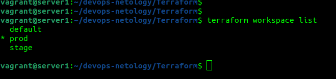
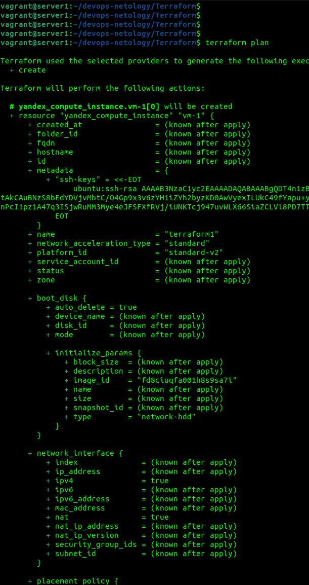
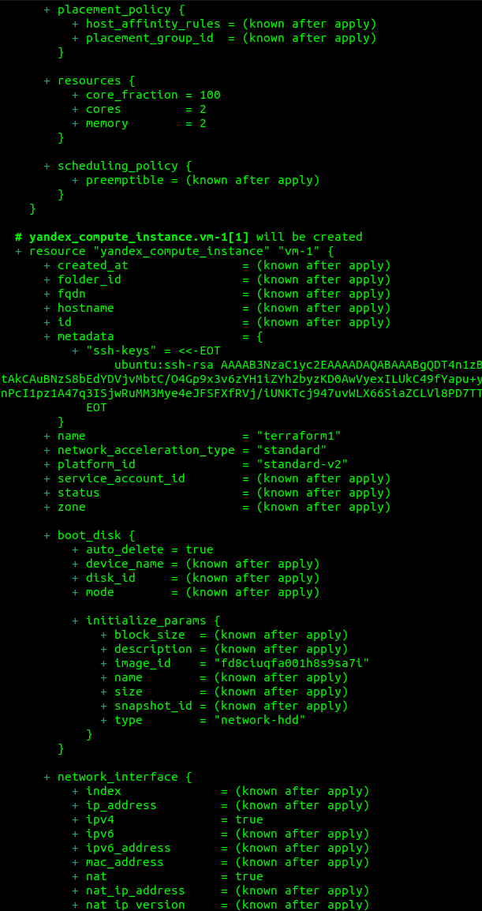
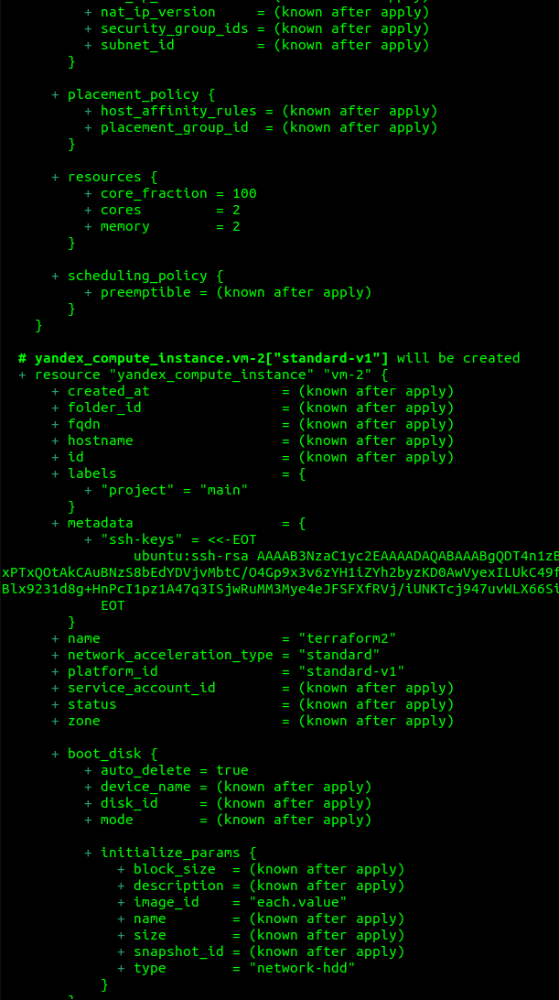
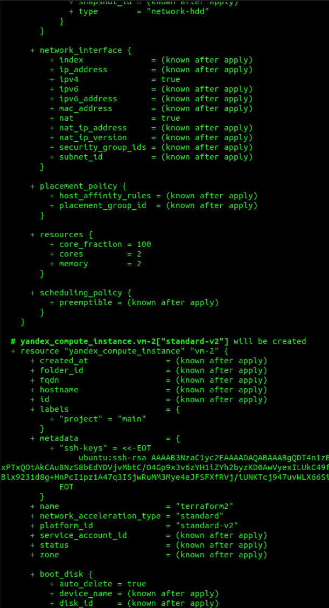
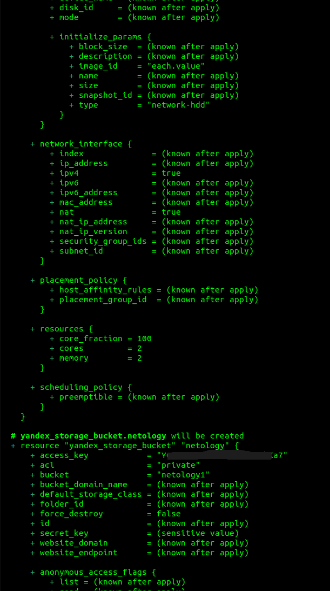
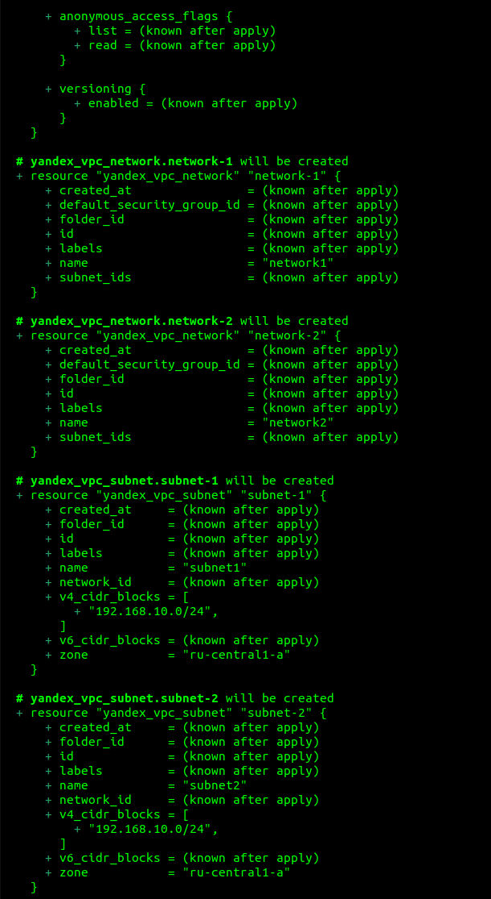
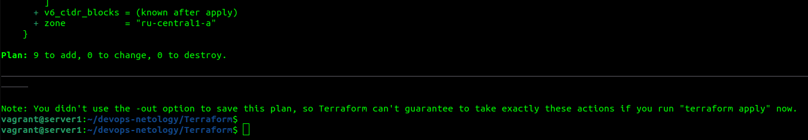
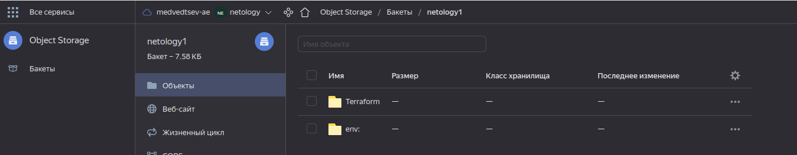
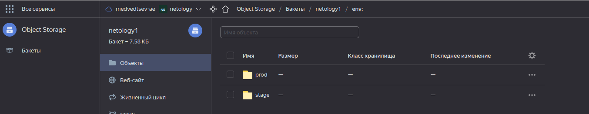

1. Работы выполнялись в Яндекс Облако. 
В виде результата работы пришлите:
* Вывод команды terraform workspace list 
* Вывод команды terraform plan для воркспейса prod

файлы стейтов размещены в ЯО:

