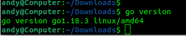
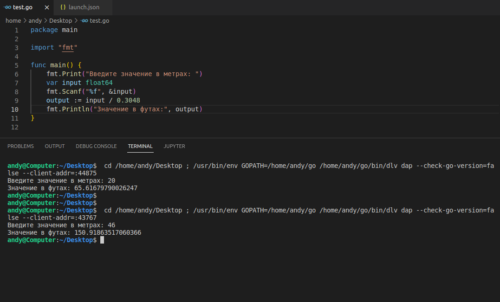
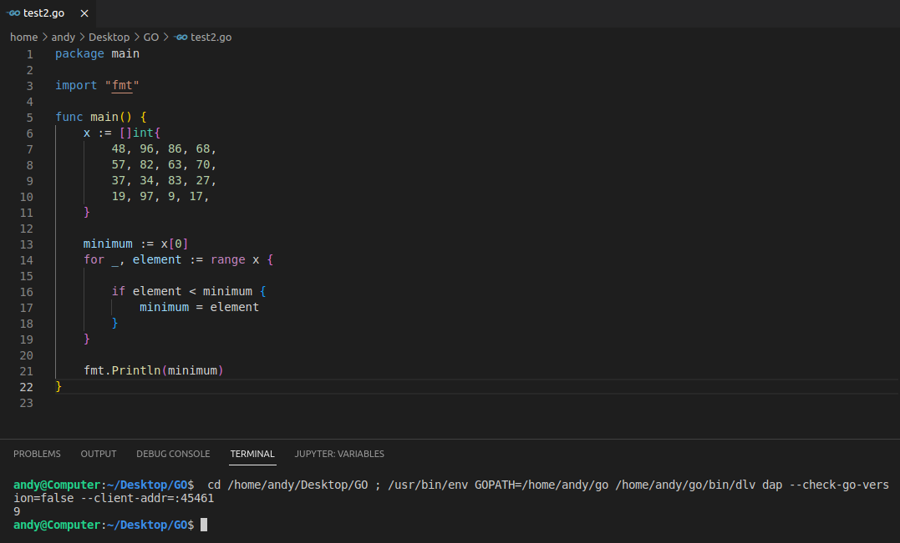
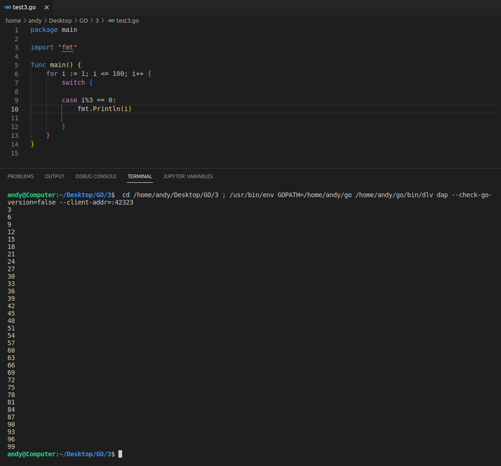

1.Установите golang. 
 выполнено: 
 
2. Знакомство с gotour. 
Выполнено. 
3. Написание кода.
* Напишите программу для перевода метров в футы

* Напишите программу, которая найдет наименьший элемент в любом заданном списке

* Напишите программу, которая выводит числа от 1 до 100, которые делятся на 3.
