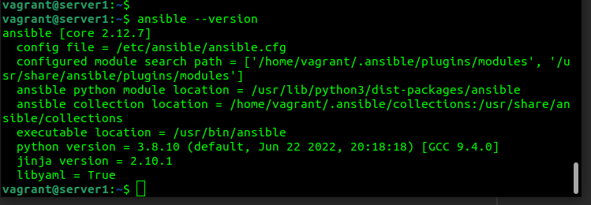
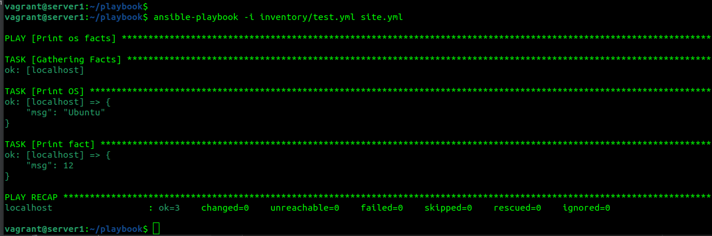
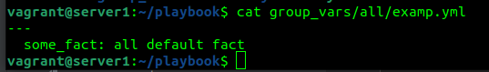
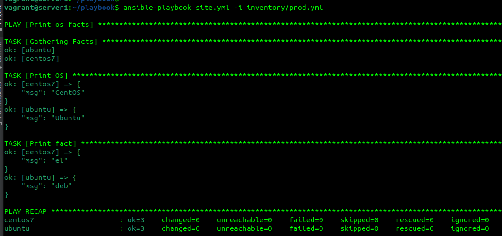
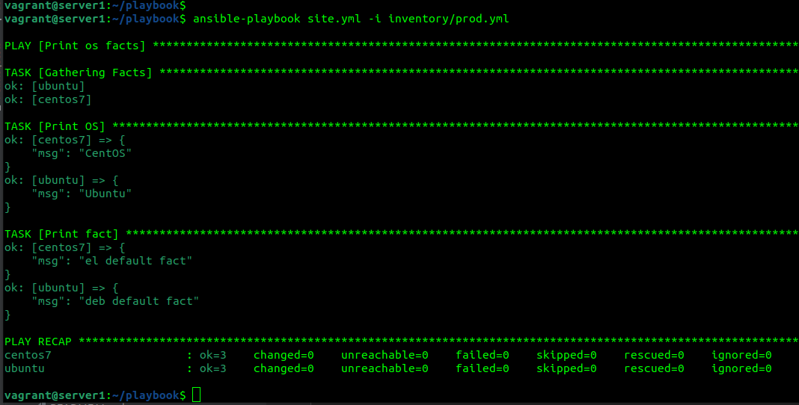
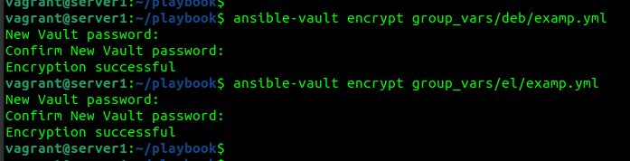
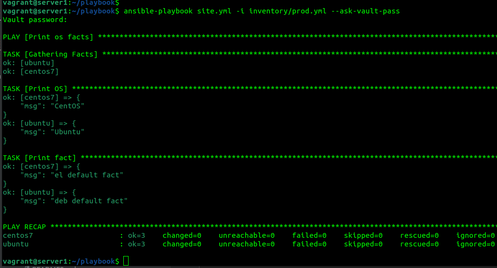
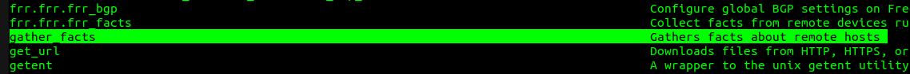
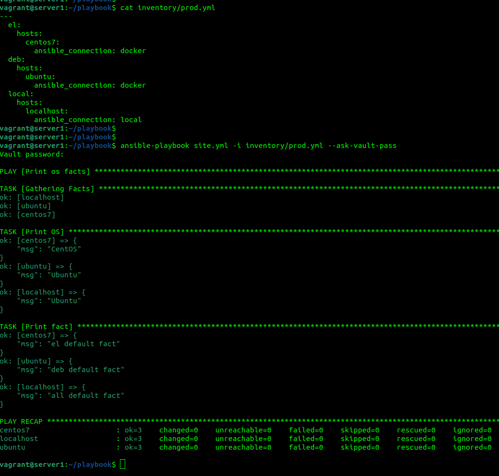

Подготовка к выполнению
1. Установите ansible версии 2.10 или выше.

2, 3. https://github.com/Andrey-Medvedtsev/netology-ansible  

Основная часть 
1. Попробуйте запустить playbook на окружении из test.yml, зафиксируйте какое значение имеет факт some_fact для указанного хоста при выполнении playbook'a. 
 
2. Найдите файл с переменными (group_vars) в котором задаётся найденное в первом пункте значение и поменяйте его на 'all default fact'. 
 
3, 4. Воспользуйтесь подготовленным (используется docker) или создайте собственное окружение для проведения дальнейших испытаний. 
Проведите запуск playbook на окружении из prod.yml. Зафиксируйте полученные значения some_fact для каждого из managed host. 
 
5, 6. Добавьте факты в group_vars каждой из групп хостов так, чтобы для some_fact получились следующие значения: для deb - 'deb default fact', для el - 'el default fact'. 
Повторите запуск playbook на окружении prod.yml. Убедитесь, что выдаются корректные значения для всех хостов. 
 

7.При помощи ansible-vault зашифруйте факты в group_vars/deb и group_vars/el с паролем netology. 

8.Запустите playbook на окружении prod.yml. При запуске ansible должен запросить у вас пароль. Убедитесь в работоспособности. 

9.Посмотрите при помощи ansible-doc список плагинов для подключения. Выберите подходящий для работы на control node. 
gather_facts - Gathers facts about remote hosts  

10, 11. В prod.yml добавьте новую группу хостов с именем local, в ней разместите localhost с необходимым типом подключения. 
Запустите playbook на окружении prod.yml. При запуске ansible должен запросить у вас пароль. Убедитесь что факты some_fact для каждого из хостов определены из верных group_vars. 

12. https://github.com/Andrey-Medvedtsev/netology-ansible/tree/main/playbook