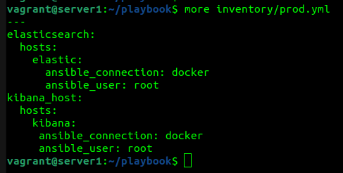
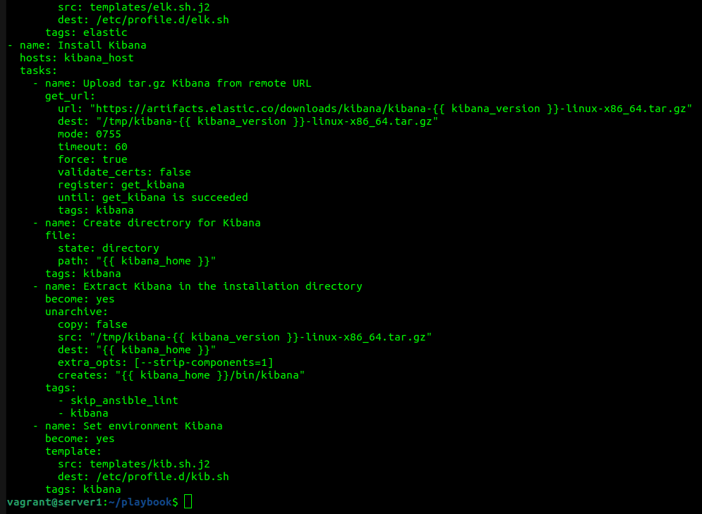
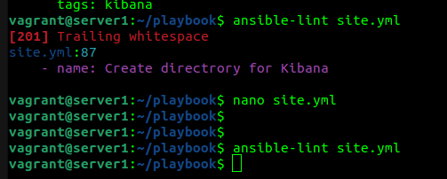
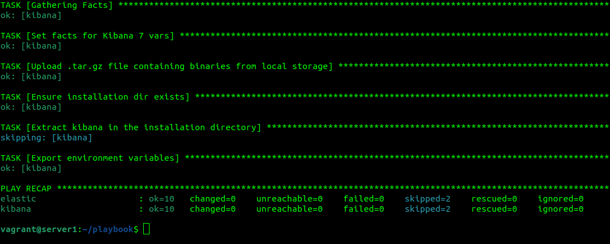
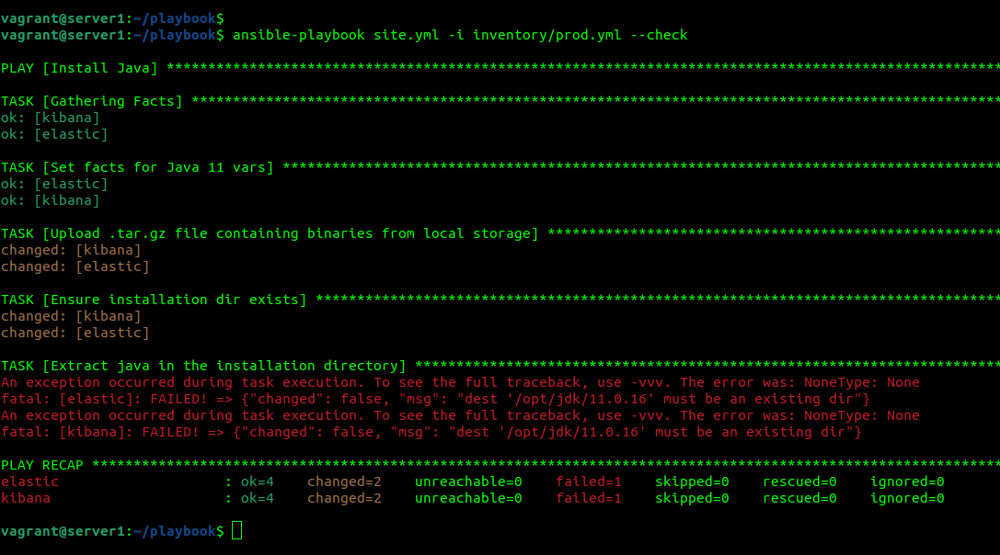
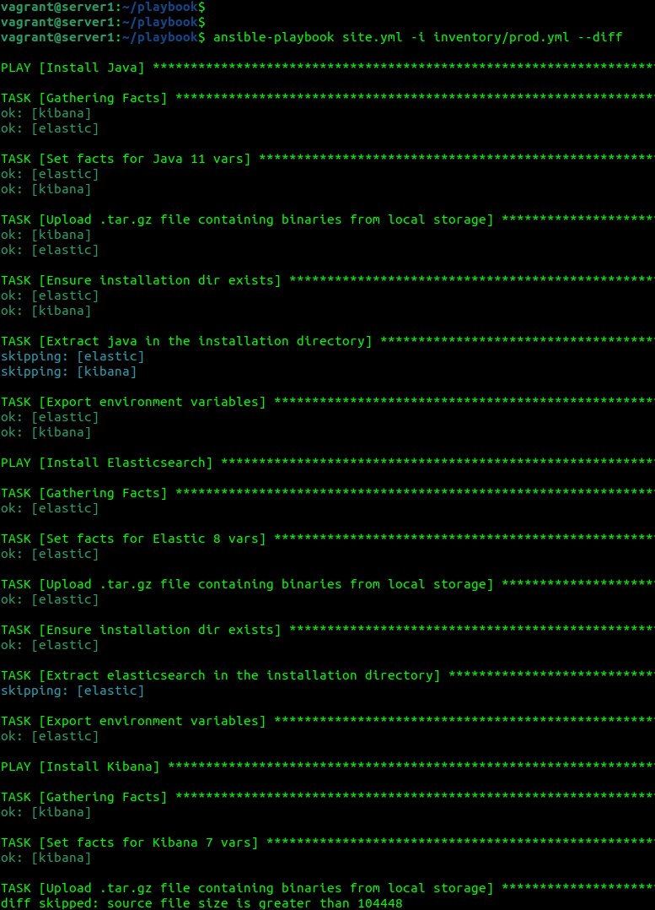
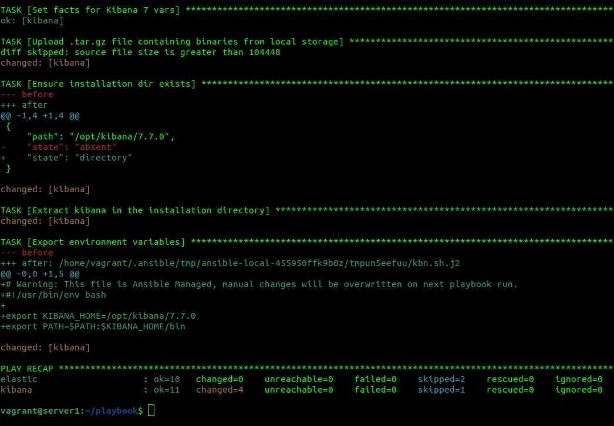
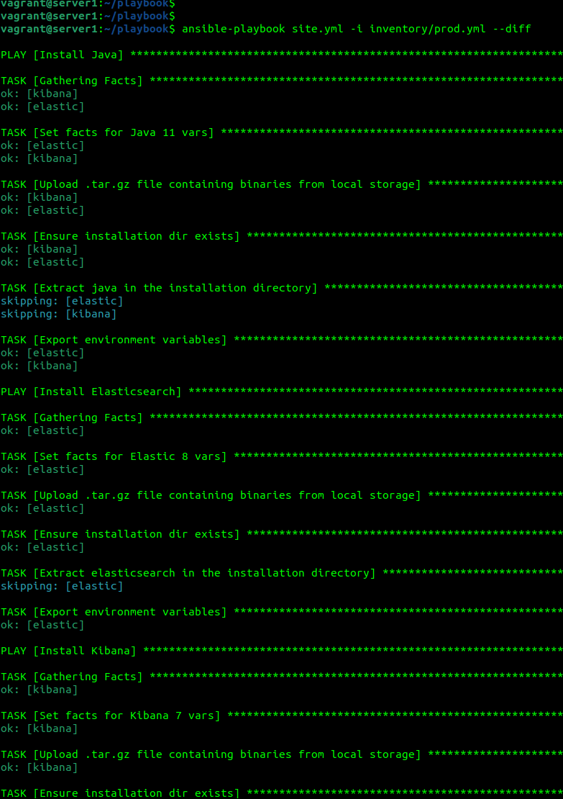
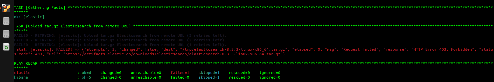

1. Приготовьте свой собственный inventory файл prod.yml
 
2, 3, 4. Допишите playbook: нужно сделать ещё один play, который устанавливает и настраивает kibana. 
При создании tasks рекомендую использовать модули: get_url, template, unarchive, file. 
Tasks должны: скачать нужной версии дистрибутив, выполнить распаковку в выбранную директорию, сгенерировать конфигурацию с параметрами. 

5.Запустите ansible-lint site.yml и исправьте ошибки, если они есть.
ошибки исправлены 
 
6.Попробуйте запустить playbook на этом окружении с флагом --check. 
 
 
7.Запустите playbook на prod.yml окружении с флагом --diff. Убедитесь, что изменения на системе произведены. 

8.Повторно запустите playbook с флагом --diff и убедитесь, что playbook идемпотентен. 
 
 
9.Подготовьте README.md файл по своему playbook. В нём должно быть описано: что делает playbook, какие у него есть параметры и теги. 
playbook выполняет загрузку, распаковку архивов, создание каталогов и установку Elasticsearch 8.3.3, Kibana 7.7.0, JDK 11.0.16
Elasticsearch 8.3.3, Kibana 7.7.0 не получается скачать даже через VPN:

поэтому пакеты Elasticsearch и Kibana загружены со сторонних источников и установка выполняется по аналогии с Java
Переменные для хостов заданы в файлах vars.yml в каталоге group_vars, шаблоны для установки переменных окружения для хостов заданы в файлах *.j2 в каталоге templates.
В тасках установлены теги для облегчения диагностики.
