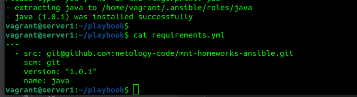
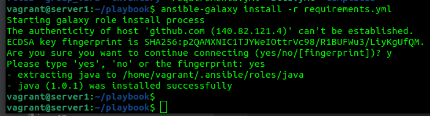
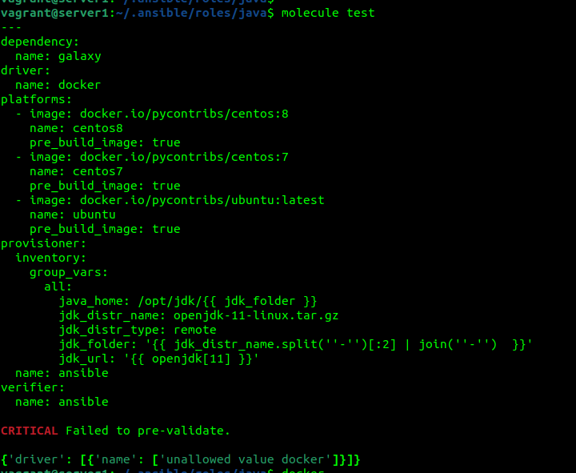
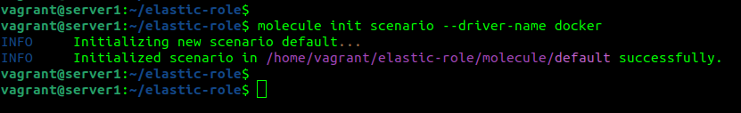
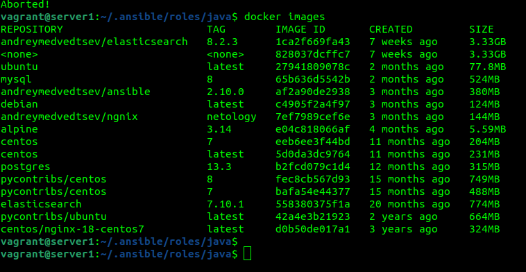
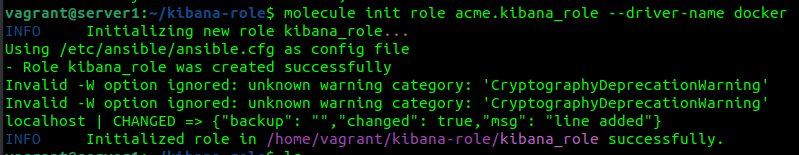
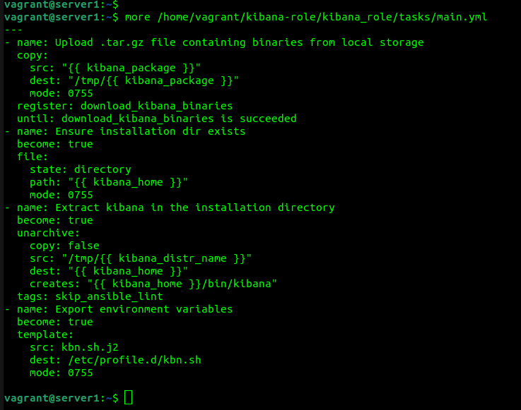
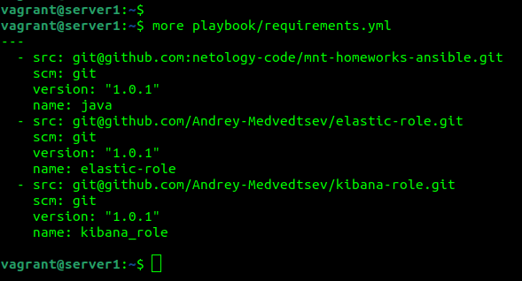
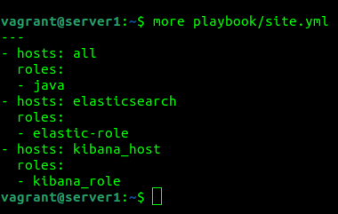

Основная часть
1. Создать в старой версии playbook файл requirements.yml и заполнить его 
 

2. При помощи ansible-galaxy скачать себе эту роль. 
 
Запустите molecule test, посмотрите на вывод команды. 
 
3. Перейдите в каталог с ролью elastic-role и создайте сценарий тестирования по умолчаню при помощи molecule init scenario --driver-name docker. 
 
4. Добавьте несколько разных дистрибутивов (centos:8, ubuntu:latest) для инстансов и протестируйте роль, исправьте найденные ошибки, если они есть. 

5. Создайте новый каталог с ролью при помощи molecule init role --driver-name docker kibana-role 

6. На основе tasks из старого playbook заполните новую role. Разнесите переменные между vars и default. Проведите тестирование на разных дистрибитивах (centos:7, centos:8, ubuntu). 

7. Выложите все roles в репозитории. Проставьте тэги, используя семантическую нумерацию. 
https://github.com/Andrey-Medvedtsev/netology_ansible_8.2/tree/v1.0.1/playbook  
https://github.com/Andrey-Medvedtsev/elastic-role/tree/v1.0.1  
https://github.com/Andrey-Medvedtsev/kibana-role/tree/v1.0.1  
8. Добавьте roles в requirements.yml в playbook. 
 
9. Переработайте playbook на использование roles. 
 
10. Выложите playbook в репозиторий. 
https://github.com/Andrey-Medvedtsev/netology_ansible_8.2/tree/v1.0.1/playbook  
11. В ответ приведите ссылки на оба репозитория с roles и одну ссылку на репозиторий с playbook. 
https://github.com/Andrey-Medvedtsev/netology_ansible_8.2/tree/v1.0.1/playbook  
https://github.com/Andrey-Medvedtsev/elastic-role/tree/v1.0.1  
https://github.com/Andrey-Medvedtsev/kibana-role/tree/v1.0.1  
Elasticsearch и Kibana не получается скачать, поэтому использовал локальную установку. На github дистрибутивы не выкладывал, кроме того файлы более 100 МБ Github не разрешает выкладывать.   