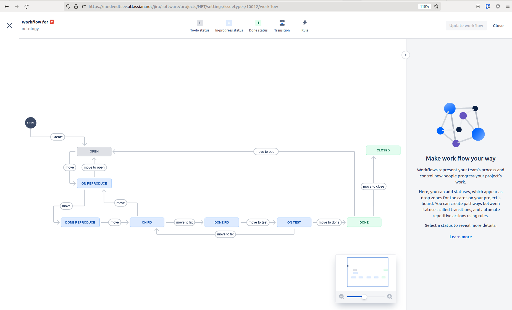
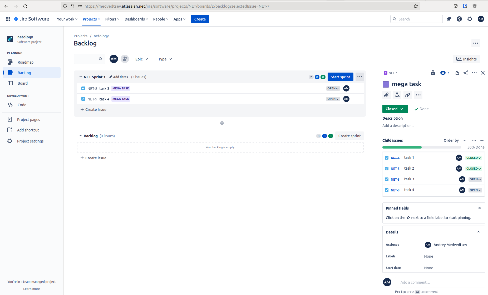
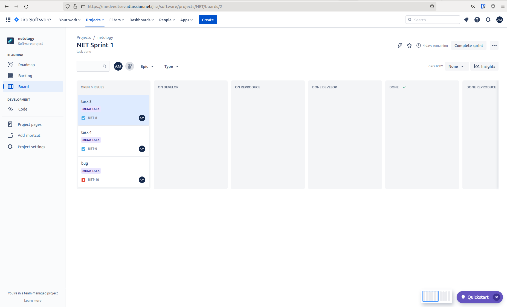
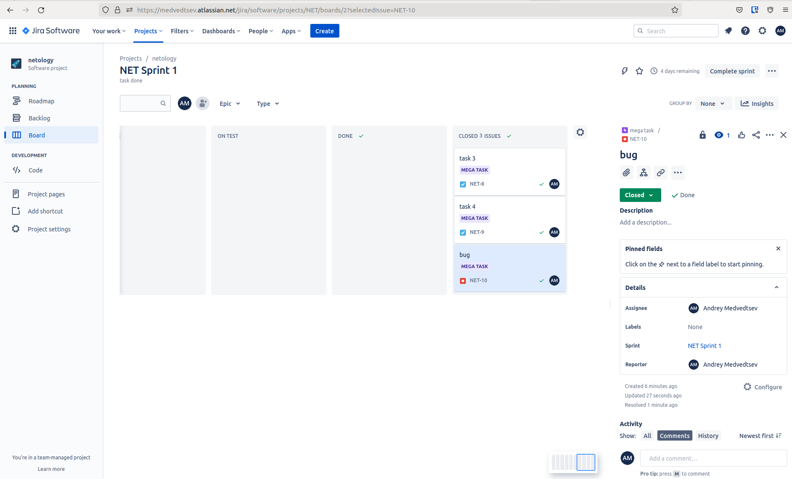
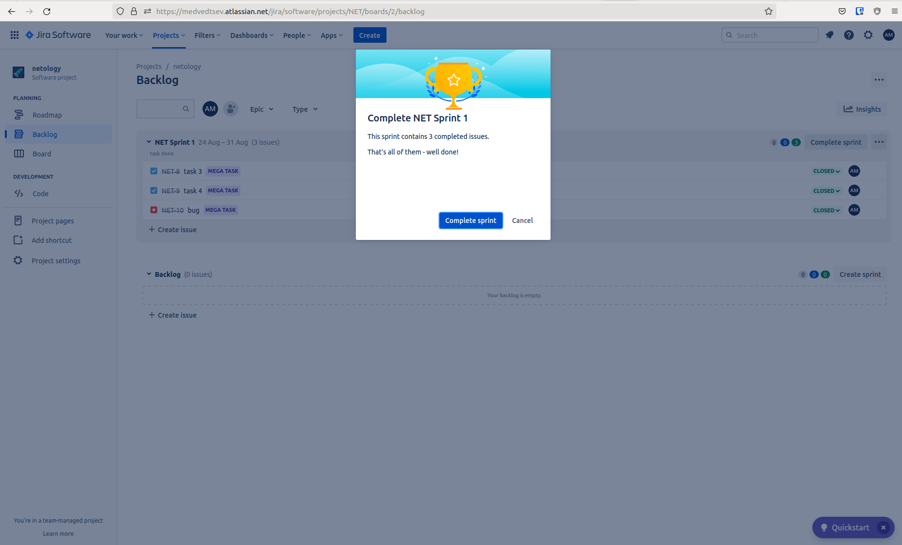
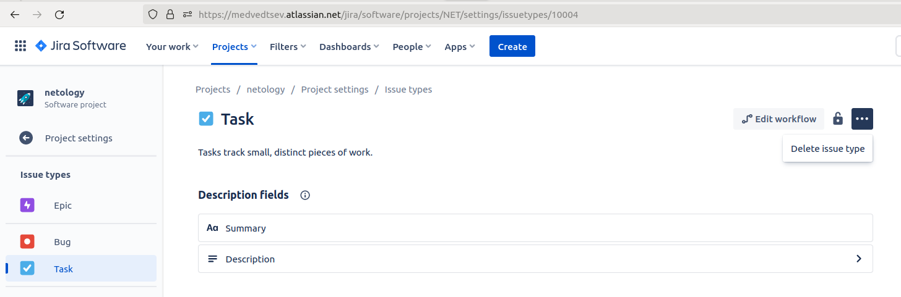
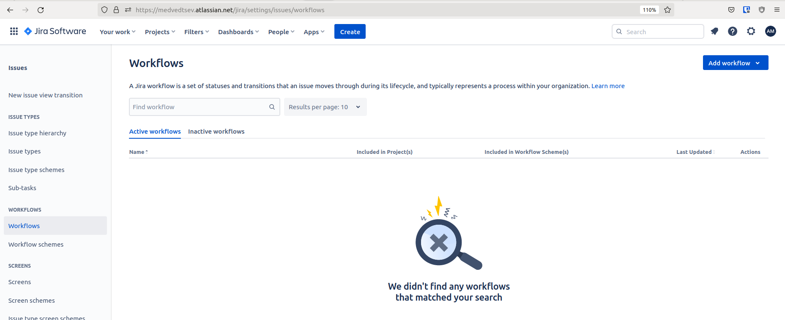

В рамках основной части необходимо создать собственные workflow для двух типов задач: bug и остальные типы задач. Задачи типа bug должны проходить следующий жизненный цикл: 
&ensp;    Open -> On reproduce  
&ensp;    On reproduce <-> Open, Done reproduce 
&ensp;    Done reproduce -> On fix 
&ensp;    On fix <-> On reproduce, Done fix 
&ensp;    Done fix -> On test 
&ensp;    On test <-> On fix, Done 
&ensp;    Done <-> Closed, Open 

Остальные задачи должны проходить по упрощённому workflow: 
&ensp;      Open -> On develop 
&ensp;      On develop <-> Open, Done develop 
&ensp;      Done develop -> On test 
&ensp;      On test <-> On develop, Done 
&ensp;      Done <-> Closed, Open 

Создать задачу с типом epic, к ней привязать несколько задач с типом task, провести их по всему workflow до Done.  

Перейти в scrum, запланировать новый спринт, состоящий из задач эпика и одного бага, стартовать спринт, провести задачи до состояния Closed. Закрыть спринт. 

Если всё отработало в рамках ожидания - выгрузить схемы workflow для импорта в XML. Файлы с workflow приложить к решению задания. 

Не нашёл как в проекте выполнить экспорт в xml, можно только отредактировать или удалить 

в профиле их нет  
