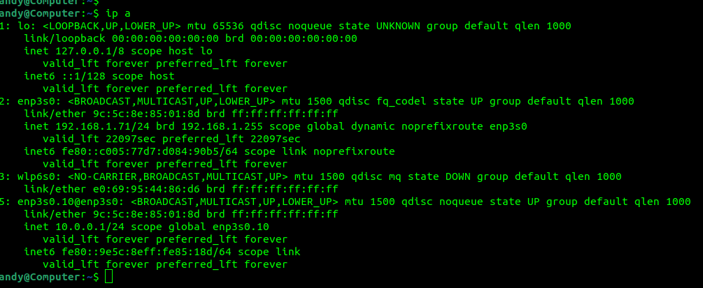
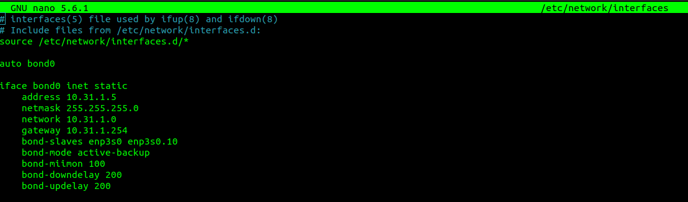
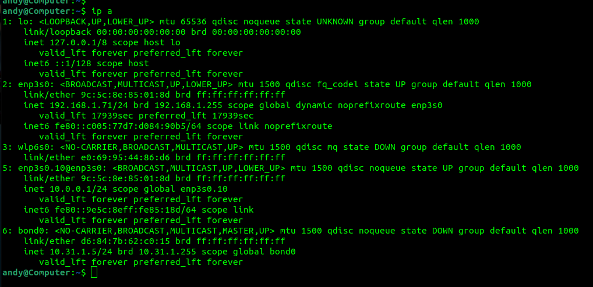
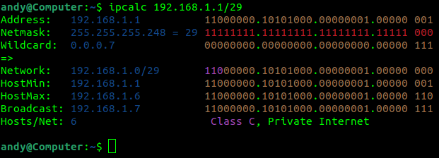
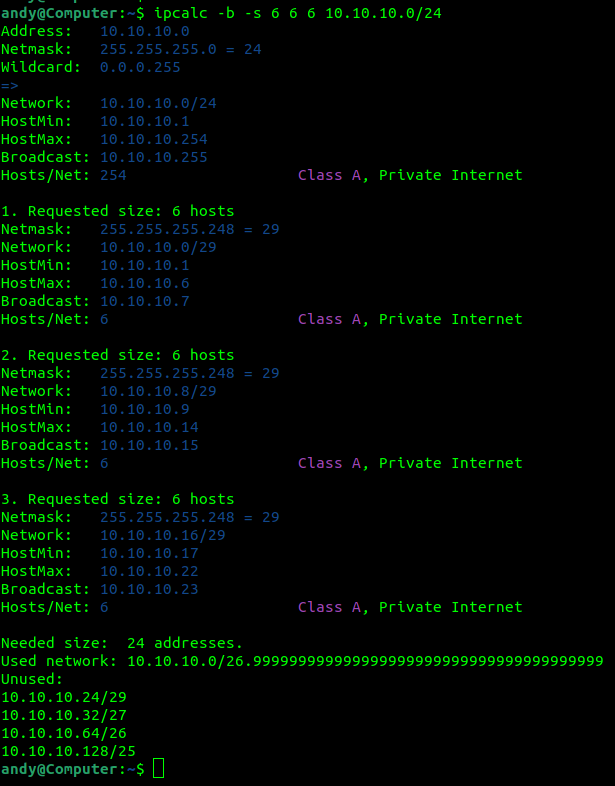
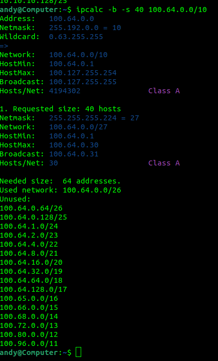

1. andy@Computer:$ ip -c -br link 
lo               UNKNOWN        00:00:00:00:00:00 <LOOPBACK,UP,LOWER_UP>  
enp3s0           UP             9c:5c:8e:85:01:8d <BROADCAST,MULTICAST,UP,LOWER_UP>  
wlp6s0           DOWN           e0:69:95:44:86:d6 <NO-CARRIER,BROADCAST,MULTICAST,UP>  
andy@Computer:$  
Команды для просмотра сетевых интерфейсов:
ip - в Linux 
ipconfig  - в Windows 
2. LLDP 
пакет lldpd 
команда lldpctl 
3. VLAN (Virtual Local Area Network) — виртуальная локальная компьютерная сеть. 
в linux устанавливается пакет vlan, iproute2. 
ip link add link enp3s0 name enp3s0.10 type vlan id 1 
ip link set dev enp3s0.10 up  
ip addr add 10.0.0.1/24 dev enp3s0.10 
 
4. LAG – агрегация портов. 
Типы LAG: 
статический; 
динамический – LACP протокол. 
 
 
опции для балансировки нагрузки: 
active-backup 
balance-xor 
broadcast 
802.3ad 
balance-tlb 
balance-alb 
5. Сколько IP адресов в сети с маской /29 ?   
6 
  
Сколько /29 подсетей можно получить из сети с маской /24 
32 
Приведите несколько примеров /29 подсетей внутри сети 10.10.10.0/24: 
 

6. Из какой подсети допустимо взять частные IP адреса? 
100.64.0.0/10 
 
7. Как проверить ARP таблицу в Linux, Windows? 
arp -a 
Как очистить ARP кеш полностью? 
ip link set arp off dev enp3s0 
Как из ARP таблицы удалить только один нужный IP? 
arp -d 192.168.1.1