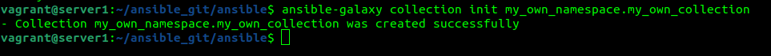
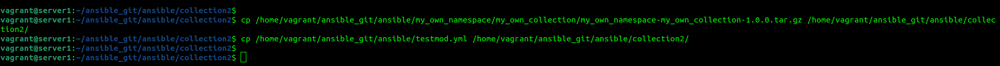

Выполнена подготовка к выполнению, виртуальное окружение запускается 

Основная часть 
1,2. Выполнено 
3. Заполните файл в соответствии с требованиями ansible так, чтобы он выполнял основную задачу: module должен создавать текстовый файл на удалённом хосте по пути, определённом в параметре path, с содержимым, определённым в параметре content 

4. Проверьте module на исполняемость локально 

5. Напишите single task playbook и используйте module в нём. 

6. Проверьте через playbook на идемпотентность. 

7.   
8. Инициализируйте новую collection 

9. В данную collection перенесите свой module в соответствующую директорию. 

10, 11. Single task playbook преобразуйте в single task role и перенесите в collection. У role должны быть default всех параметров module. Создайте playbook для использования этой role. 

12. https://github.com/Andrey-Medvedtsev/my_own_collection/tree/1.0.0 
13.  
14.  
15.  
16.  
17. https://github.com/Andrey-Medvedtsev/my_own_collection/tree/1.0.0 