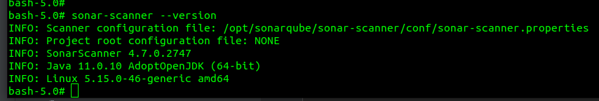
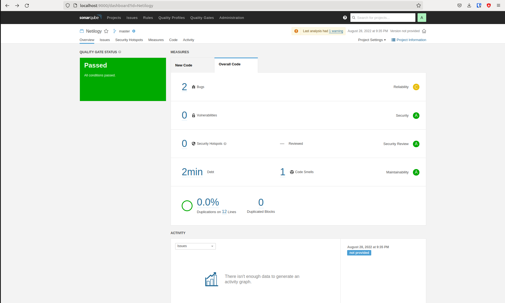
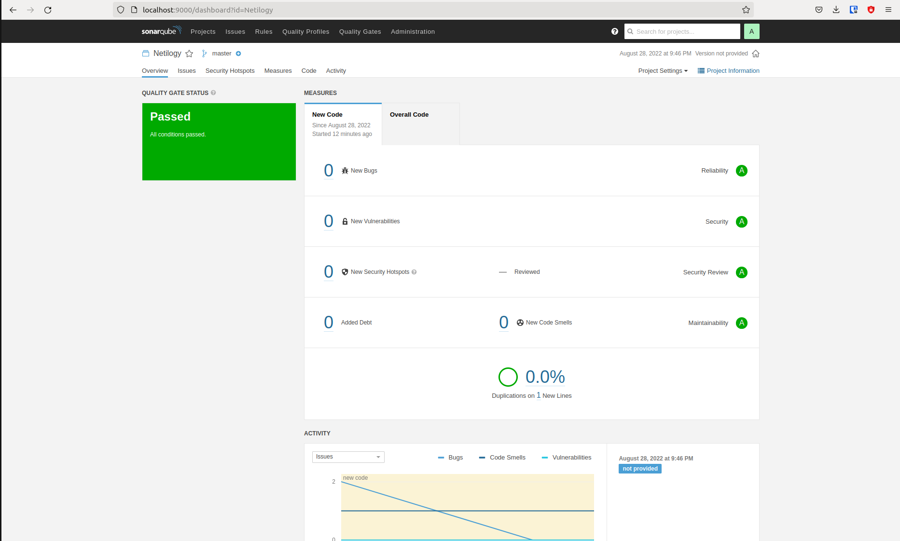
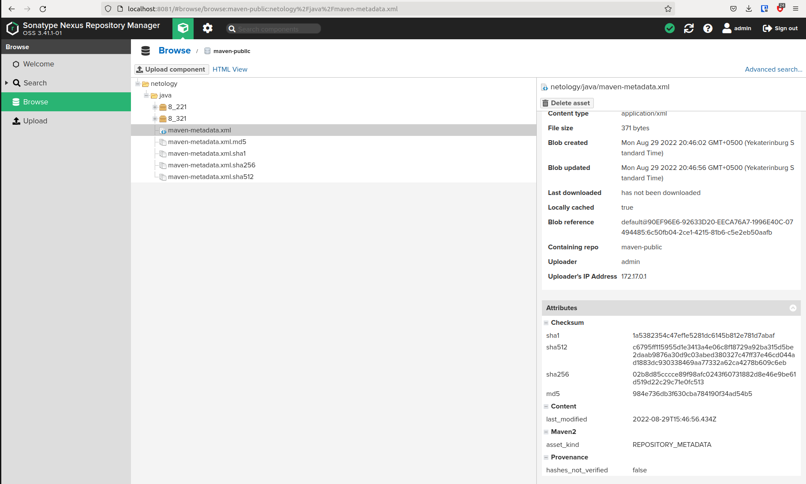
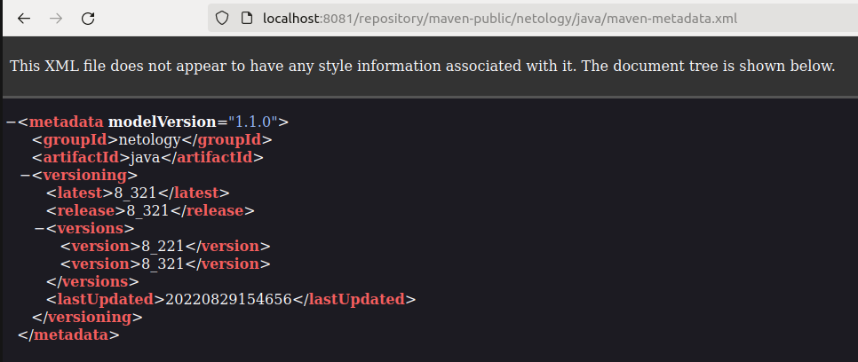
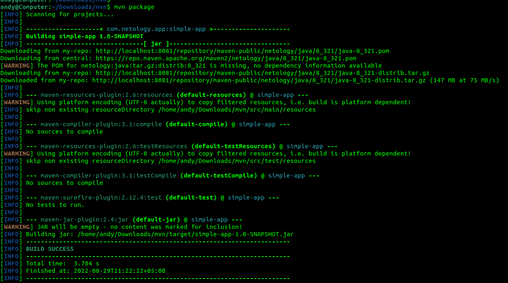
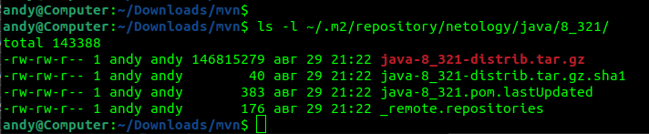
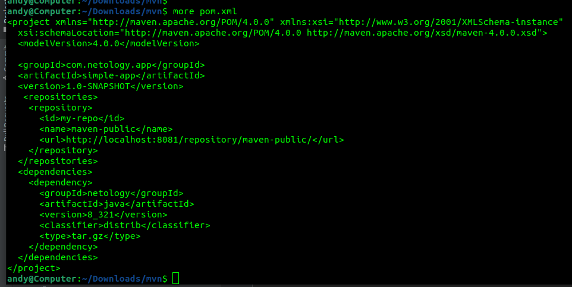

Знакомство с SonarQube  
пункты 1 - 3 выполнены
4. Проверяем sonar-scanner --version

5. Запускаем анализатор против кода из директории example с дополнительным ключом -Dsonar.coverage.exclusions=fail.py 
6. Смотрим результат в интерфейсе

7. Исправляем ошибки, которые он выявил(включая warnings)
8. Запускаем анализатор повторно - проверяем, что QG пройдены успешно
9. Делаем скриншот успешного прохождения анализа, прикладываем к решению ДЗ

Знакомство с Nexus
1. В репозиторий maven-public загружаем артефакт с GAV параметрами: 
*    groupId: netology
*    artifactId: java
*    version: 8_282
*    classifier: distrib
*    type: tar.gz 

не нашёл 8_282, загрузил 8_321
2. В него же загружаем такой же артефакт, но с version: 8_102 
не нашёл 8_102, загрузил 8_221
3. Проверяем, что все файлы загрузились успешно

4. В ответе присылаем файл maven-metadata.xml для этого артефекта

Знакомство с Maven
1. Меняем в pom.xml блок с зависимостями под наш артефакт из первого пункта задания для Nexus (java с версией 8_282) 
выполнено для 8_321
2. Запускаем команду mvn package в директории с pom.xml, ожидаем успешного окончания 

3. Проверяем директорию ~/.m2/repository/, находим наш артефакт

4. В ответе присылаем исправленный файл pom.xml
