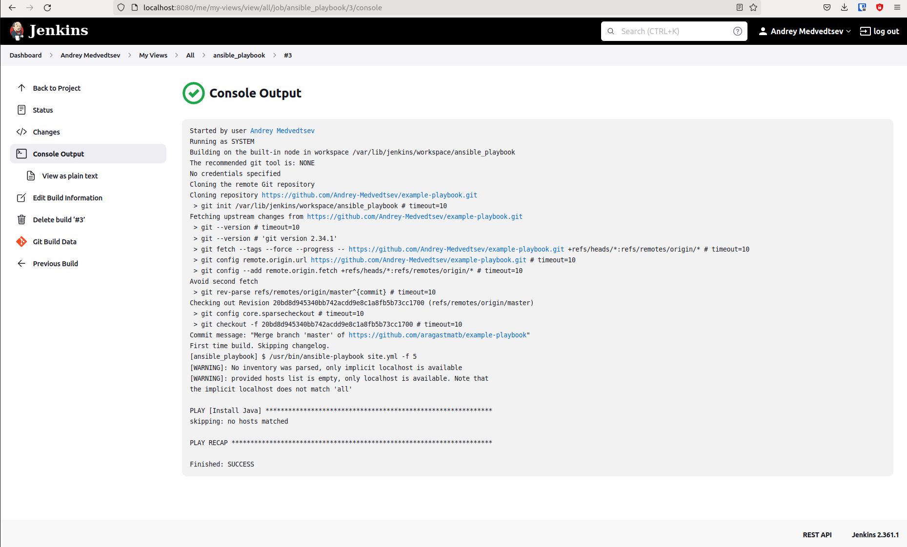
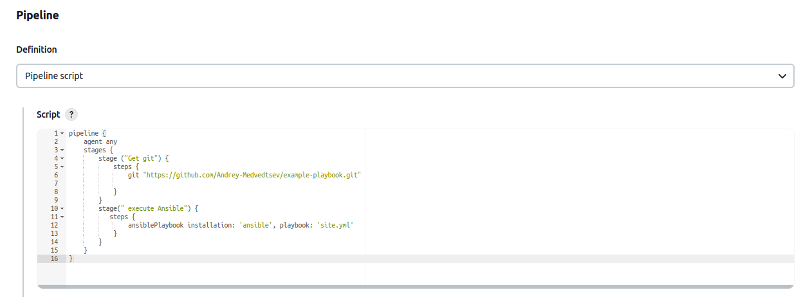
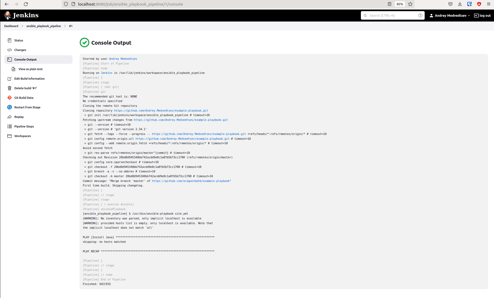
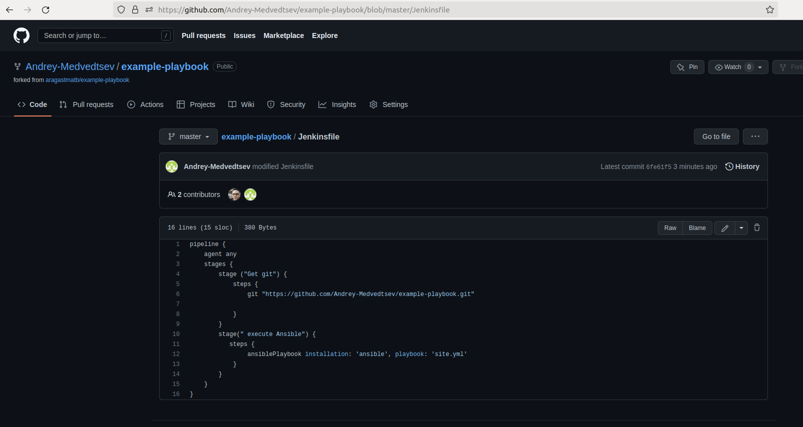
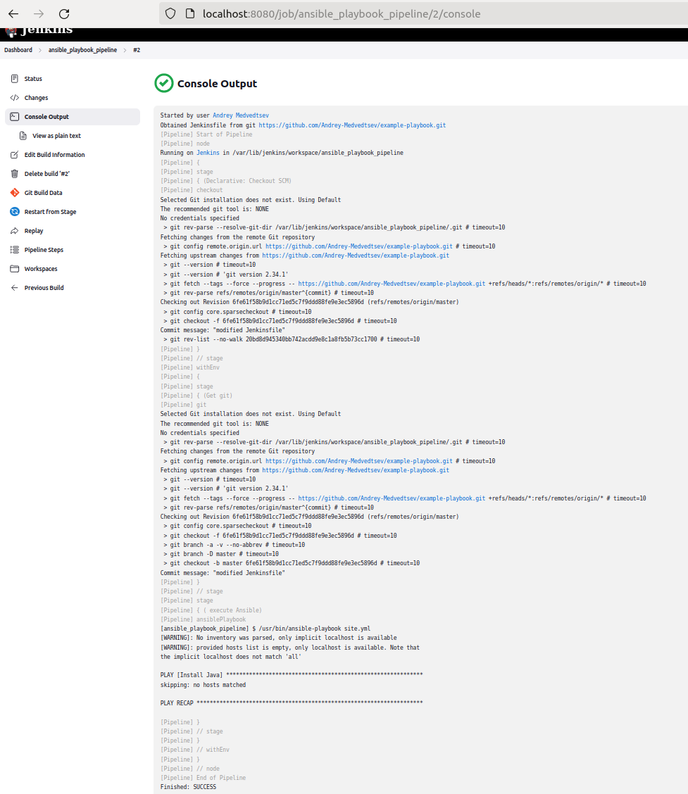
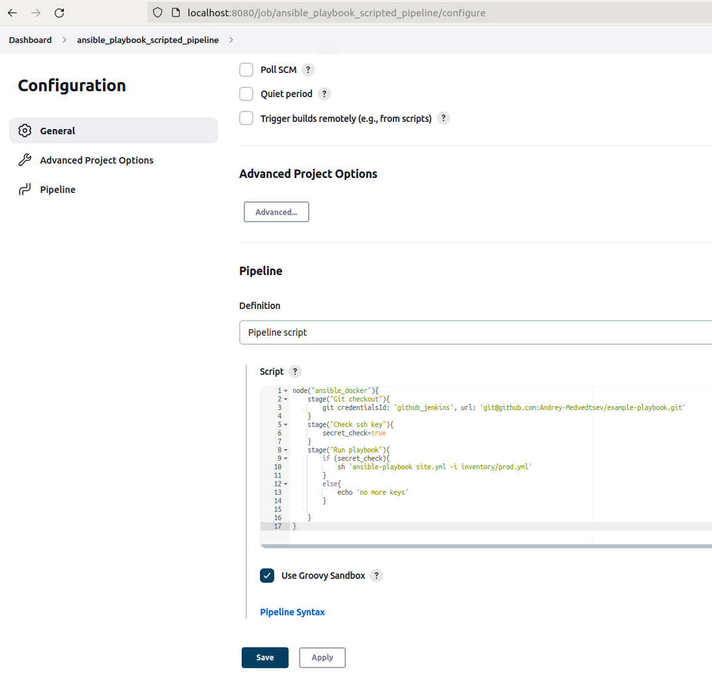
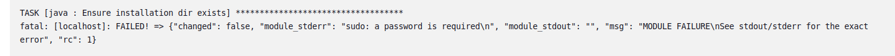
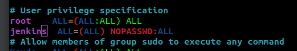
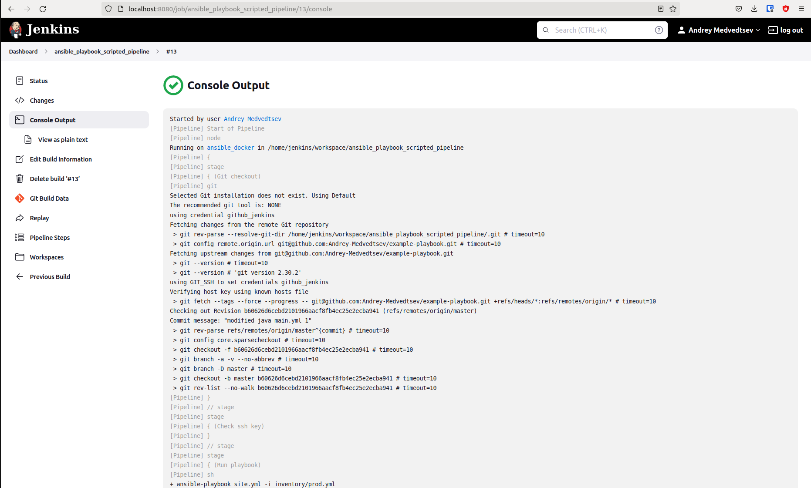
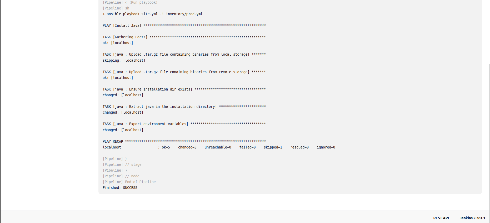

1. Сделать Freestyle Job, который будет запускать ansible-playbook из форка репозитория 

2. Сделать Declarative Pipeline, который будет выкачивать репозиторий с плейбукой и запускать её 

3. Перенести Declarative Pipeline в репозиторий в файл Jenkinsfile 

4. Перенастроить Job на использование Jenkinsfile из репозитория 

5, 6. Создать Scripted Pipeline, наполнить его скриптом из pipeline. Заменить credentialsId на свой собственный 

7. Проверить работоспособность, исправить ошибки, исправленный Pipeline вложить в репозиторий в файл ScriptedJenkinsfile 
при выполнении возникла ошибка  
 
добавил пользователя jenkins в sudoers, ошибка ушла 
 
других ошибок не было, сборка прошла успешно 

8. Отправить ссылку на репозиторий в ответе  
https://github.com/Andrey-Medvedtsev/example-playbook.git
