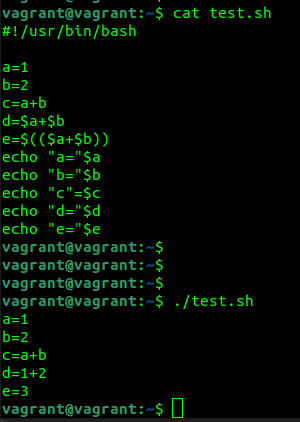
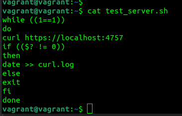
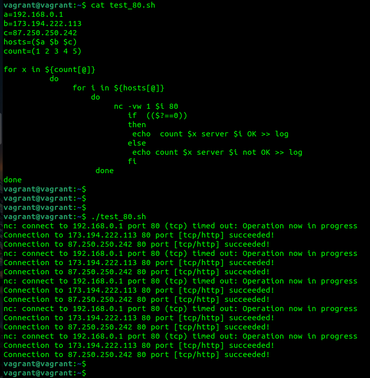
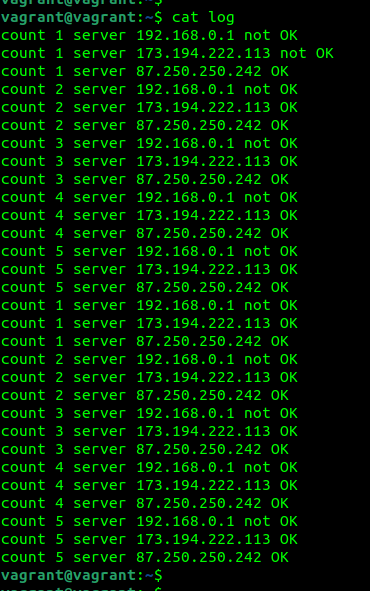
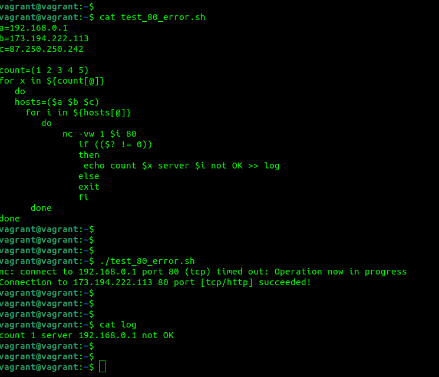

1.   
значение переменной "c" равно "a+b" потому что bash воспринимает значение переменной как строку. 
значение переменной "d" равно "1+2" потому что bash выведет строку со значением переменных "a" и "b". 
значение переменной "e" равно "3" потому что будет выполнена операция сложения значений переменных "a" и "b". 
2.   
3.   
  
4.   