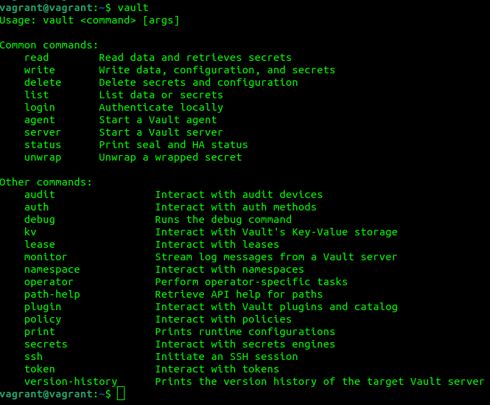

1.   
2. sudo ufw allow 22 
sudo ufw allow 443 
sudo ufw allow in on lo to any 
sudo ufw allow out on lo to any 
sudo ufw enable 
 
3.   
 
4. echo 'export PATH=$PATH:/etc/vault/' >> ~/.profile 
 
vault server -config config.hcl 
export VAULT_ADDR='http://127.0.0.1:8200' 
vault operator init 
vault operator unseal PSD2huj9wY8ey+cPe7ZqLtVgI9MhhlCHbvUfm70FOgSd 
vault operator unseal Fh2UavlUuKt+TfBpMK0ex3QM1IUwPmpJwGcdkbvdIRR3 
vault operator unseal i4TU7gIRmrBqL2Xf/qFuRfGiGZJ9dfsTflgjYiDnhqeo 
vault login 
vault secrets enable pki 
vault secrets tune -max-lease-ttl=87600h pki 
vault write -field=certificate pki/root/generate/internal common_name="test.com" ttl=87600h > CA_cert.crt 
vault write pki/config/urls issuing_certificates="$VAULT_ADDR/v1/pki/ca"      crl_distribution_points="$VAULT_ADDR/v1/pki/crl" 
vault secrets enable -path=pki_int pki 
vault secrets tune -max-lease-ttl=43800h pki_int 
vault write -format=json pki_int/intermediate/generate/internal common_name="test.com Intermediate Authority"      | jq -r '.data.csr' > pki_intermediate.csr 
vault write -format=json pki/root/sign-intermediate csr=@pki_intermediate.csr format=pem_bundle ttl="43800h"  | jq -r '.data.certificate' > intermediate.cert.pem 
vault write pki_int/intermediate/set-signed certificate=@intermediate.cert.pem 
vault write pki_int/roles/test-dot-com  allowed_domains="test.com"  allow_subdomains=true max_ttl="720h" 
vault write pki_int/issue/test-dot-com common_name="host.test.com" ttl="720h" 

5. curl -s http://127.0.0.1:8200/v1/pki/ca/pem  
scp root.crt andy@192.168.1.33:/home/andy 

6. sudo apt install curl gnupg2 ca-certificates lsb-release ubuntu-keyring 
curl https://nginx.org/keys/nginx_signing.key | gpg --dearmor | sudo tee /usr/share/keyrings/nginx-archive-keyring.gpg >/dev/null 
echo "deb [signed-by=/usr/share/keyrings/nginx-archive-keyring.gpg] http://nginx.org/packages/ubuntu `lsb_release -cs` nginx" | sudo tee /etc/apt/sources.list.d/nginx.list 
echo -e "Package: *\nPin: origin nginx.org\nPin: release o=nginx\nPin-Priority: 900\n" \ | sudo tee /etc/apt/preferences.d/99nginx 
sudo apt update 
sudo apt install nginx 
systemctl enable nginx 
7. 
 
8.
 
 
9. скрипт 
 
10. в crontab прописать: 
sudo crontab -e 
для демонстрации: 
*/1 * * * * /home/vagrant/gen_cert.sh 
для задания: 
 
 
 